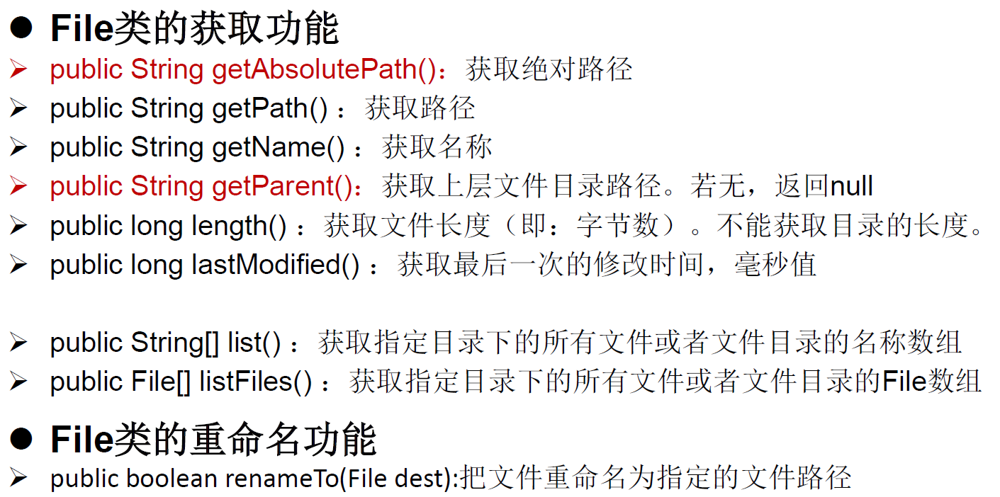
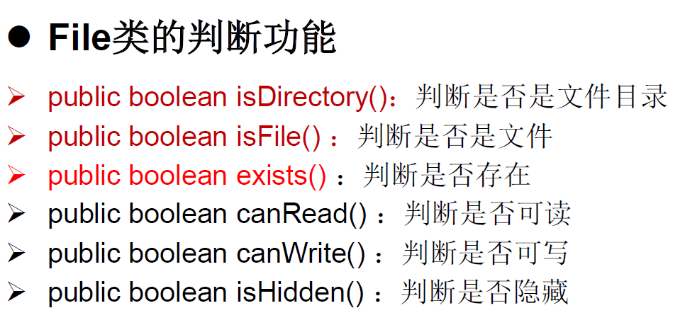
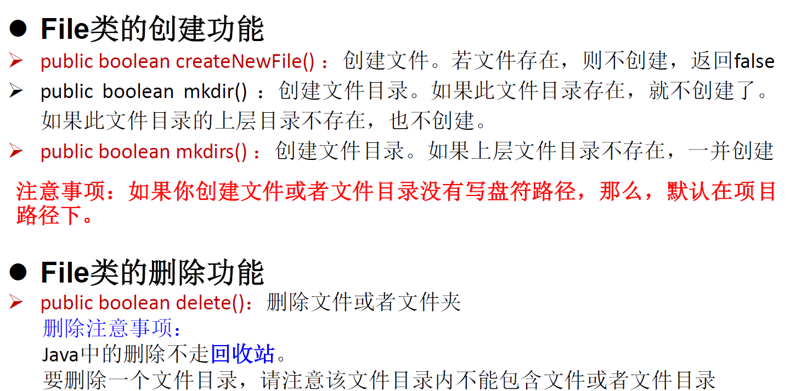
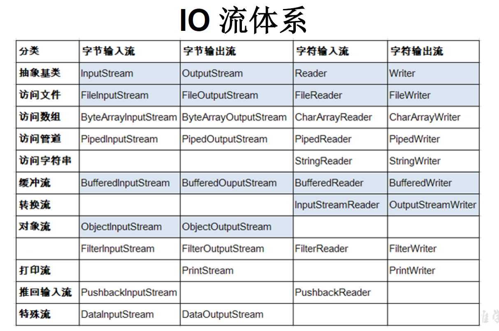

# File类：

- File类的一个对象，代表一个文件或者一个文件目录

- File类的声明在java.io包下
- File类中涉及到了文件的创建、删除、重命名、修改时间、文件大小等方法，并未涉及到写入或读取文件内容的操作。如需要读取或写入文件内容，必须使用IO流来完成
- 后续File类对象常会作为参数传递到流的构造器中，指明读取或写入的“终点”

## File类的实例化：

### 构造器：

- public File(String pathname)

	以pathname 为路径创建 File 对象，可以是 绝对路径 或者 相对路径 ，如果 pathname 是相对路径，则默认的当前路径在系统属性 user.dir 中存储。

- public File(String parent,String child)

	以 parent 为父路径， child 为子路径创建 File 对象 。

- public File(File parent,String child)

	根据一个父 File 对象和子文件路径创建 File 对象

### 路径：

路径的分类有两种：一种是相对路径（相对于当前路径），一种是绝对路径（从盘符开始一直到文件名）

在IDEA中，如果使用JUnit中的单元测试方法测试，相对路径即为当前Module下

如果使用main方法进行测试，相对路径即为当前Project下

在Eclipse中，使用的无论是单元测试方法还是mail()方法，相对路径都是当前的project下

#### 路径分隔符：

- windows 和 DOS 系统默认使用“\\”来表示
- UNIX 和 URL 使用“/”来表示

由于Java是跨平台语言，分隔符最好还是要慎用。为了解决这个隐患， File 类提供了一个常量：public static final String separator。根据操作系统，动态的提供分隔符。File file2 = new File("d:"+ separator + " atguigu"+ separator + "info.txt");

### 常用方法：

# IO流：

所谓的I/O流指的是Input和Output。数据进行传输而形成数据流（Stream）。

## 数据流的分类：

- 按操作数据单位不同分为：字节流（8 bit）和字符流（16 bit）。

	字节流传输的是字节（0100100类型的）二进制数据，用于视频、音频、照片等的传输

	字符流传输的是字符，适用于文件的内容、文字等

- 按数据流的流向不同分为：输入流和输出流

- 按流的角色的不同分为：节点流和处理流。

	节点流是指由文件的节点直接向内存（程序）传输的数据流

	处理流是指在节点流之外对节点流做进一步的包装，作用是加快节点流的传输

## 流的抽象类：

| （抽象基类） | 字节流       | 字符流 |
| ------------ | :----------- | ------ |
| 输入流       | InputStream  | Reader |
| 输出流       | OutputStream | Writer |

所有的IO流体系都是基于上述四个抽象类延伸的（一般在相关类上会带有相关上述抽象类的名字）

表中加深蓝色的类需要重点关注

| 抽象基类     | 节点流（或文件流） | 缓冲流（处理流的一种） |
| ------------ | ------------------ | ---------------------- |
| InputStream  | FileInputStream    | BufferedInputStream    |
| OutputStream | FileOutputStream   | BufferedOutputStream   |
| Reader       | FileReader         | BufferedReader         |
| Writer       | FileWriter         | BufferedWriter         |

### 节点流：

一般地，使用数据流读取文件处理分为四步：

1. 创建File对象，指向我们要处理的文件
2. 创建数据流对象，建立数据存放文件
3. 创建一个临时存放数据的数组
4. 调用流对象的读取方法将流中的数据读入到数组中
5. 关闭资源

~~~java
FileReader fr = null;
//使用try-finally是为了确保能够执行fr.close()
try {
    File fi = new File("C:\\Users\\Program\\Java\\Learning\\EclipseKeys.java");
    fr = new FileReader(fi);
    char[] cube = new char[5];
    int len;
    //使用数组分批次读取，要比一个一个读取效率高
    while ((len = fr.read(cube)) != -1) {
        //len不能使用cube.length()替代
        for (int i = 0; i < len; i++) {
            System.out.print(cube[i]);
        }
    }
    //也可以使用下面的写法，缺点是耗内存,浪费大
    // while ((len = fr.read(cube,0,len))!= -1) {
    // String str = new String(cube);
    // System.out.print(str);
    // }
} catch (IOException e) {
    e.printStackTrace();
} finally {
    try {
        //判断是否读取成功，不然不成功的话还会报错
        if (fr != null)
            fr.close();
    } catch (IOException e) {
        e.printStackTrace();
    }
}
~~~

一般的，使用数据流写入文件需要四步：

1. 提供File类对象，指明写出到的文件
2. 提供FileWriter对象，用于数据的写出
3. 写出的操作
4. 流资源的关闭

这种操作写入到文件中，不是删除原有的文件再用新文件去替换，而是替换了原有的文件的内容，并非删除。

如果使用构造器 FileOutputStream(file,true)，则目录下的同名文件不会被覆盖在文件内容末尾追加内容。

~~~java
FileReader fr = null;
FileWriter fw = null;
try {
    File f1 = new File("C:\\Users\\Program\\Java\\Learning\\EclipseKeys.java");
    File f2 = new File("HelloJava.java");

    fr = new FileReader(f1);
    fw = new FileWriter(f2);

    char[] ch = new char[5];
    int len;

    while ((len = fr.read(ch)) != -1) {
        //写入指定长度的字符
        fw.write(ch,0,len);
    }
} catch (IOException e) {
    e.printStackTrace();
} finally {
    try {
        //判断不为空，才能执行关闭操作
        if (fr != null)
            fr.close();
    } catch (IOException e) {
        e.printStackTrace();
    }
    //上一个try-catch间断不会影响下一个运行
    try {
        if (fw != null)
            fw.close();
    } catch (IOException e) {
        e.printStackTrace();
    }
}
~~~

在对字节流进行读取的时候，其实也是可以读取字符的，但只能正确处理英文和数字。因为英文和数字按照ASCII码来存储时，只占用一个字节，正好和字节对上。而中文的存储是双字节的，在读取和处理的时候会因此乱码。既然Java已经提供了专门的字节和字符处理类，我们也应遵照这种方式分别处理。

如果字节流过大、过长时，接受的临时数组容量可以设置得大一点（通常是1024，在实际开发时，会有专门的方法提供）

### 缓冲流：

一般的，使用缓冲流读取、处理文件需要五步：

1. 提供File类对象，指明要处理的文件
2. 提供字节流的、输入或输出流的对象，用于数据的读取和写入
3. 构造对应的缓冲流，并将相应的字节流作为参数传入
4. 创建临时数组，用于存储读取的数据
5. 读取、写入的操作
6. 资源的关闭。（实际上只要关闭缓冲流即可，缓冲流在节点流的外层，在调用缓冲流的关闭方法时会自动调用节点流的关闭方法）

~~~java
BufferedInputStream fr = null;
BufferedOutputStream fw = null;
try {
    File f1 = new File("C:\\Users\\Program\\Java\\Learning\\EclipseKeys.java");
    File f2 = new File("HelloJava.java");

    FileInputStream p1 = new FileInputStream(f1);
    FileOutputStream p2 = new FileOutputStream(f2);

    fr = new BufferedInputStream(p1);
    fw = new BufferedOutputStream(p2);

    byte[] cube = new byte[5];
    int len;

    while ((len = fr.read(cube)) != -1) {
        fw.write(cube,0,len);
        //fw.flush();
        //显示地刷新缓存区。缓冲流默认提供8k的缓冲区，当缓冲区满了的时候
        //会自动刷新缓冲区，将数据转化成输出流进入下一个流程。
    }
} catch (IOException e) {
    e.printStackTrace();
} finally {
    if (fr != null) {
        try {
            fr.close();
        } catch (IOException e) {
            e.printStackTrace();
        }
    }
    if (fw != null) {
        try {
            fw.close();
        } catch (IOException e) {
            e.printStackTrace();
        }
    }
}
~~~

对于读取字符流而言，除了使用char数组接收外，还可以使用String字符串来接收（使用fr.readLine()方法读取）。不过不同的是，该方法不会读取换行符，这就意味着需要在String字符串后加上"\n"或者在write()方法后加上newLine()方法。

**加密算法**中可能需要对临时数组中的元素进行一一更改，此时切忌使用for-each循环，要赋值的只是循环体内临时创建的变量（每次循环前被临时数组赋值），而不是对临时数组进行更改，这种做法是无用的。正确的做法是使用for-i循环，通过下标索引更改。

### 转换流：

- InputStreamReader：

	本质上属于字符流，用于将字节流输入流转换成字符流输入流

- OutputStreamWriter：

	本质上属于字符流，用于将字符流输出流转换成字节流输出流

#### 编码与解码：

- 解码：

	字节 ----> 字符（由乱码按照一定的规则读取，呈现正确的结果）

- 编码：

	字符 ----> 字节（由字符按照一定的规则分解成字节，以便于储存、复制等操作）

#### 字符编码：

##### 字符集：

- ASCII：

	美国标准信息交换码，用一个字节的 7 位可以表示。

- ISO8859-1：

	拉丁码表，欧洲码表。用一个字节的 8 位表示。

- GB2312：

	中国的中文编码表 。**最多**两个字节编码所有字符（每个字节各7位，最高位0/1表示单字节/双字节）

- GBK：

	中国的中文编码表升级，融合了更多的中文文字符号。最多两个字节编码（同GB2312）

- Unicode：

	融合了目前人类使用的所有字符。为每个字符分配唯一的字符码。所有的文字都用两个字节来表示。在 Unicode 出现之前，所有的字符集都是和具体编码方案绑定在一起的。

	Unicode 不完美，这里就有三个问题，一个是，我们已经知道，英文字母只用一个字节表示就够了，第二个问题是如何才能区别 Unicode 和 ASCII ？计算机怎么知道两个字节表示一个符号，而不是分别表示两个符号呢？第三个，如果和 GBK 等双字节编码方式一样，用最高位是 1 或 0 表示两个字节和一个字节，就少了很多值无法用于表示字符，不够表示所有字符。Unicode在很长一段时间内无法推广，直到互联网的出现 。

- UTF-8：

	变长的编码方式，可用1-4个字节来表示一个字符。其每次8个位传输数据，使得Unicode得到广泛的应用。

Unicode只是定义了一个字符集，（每一个文字在其中都有唯一的标识码）具体的实现还要依赖于UTF-8/UTF-16等字符编码方案。Unicode的存储形式是16进制，如果需要传输一个字符，则需要在Unicode中找到其唯一的标识码，并转化成对应的二进制。UTF-8则根据需要的字节长度进行组合。

##### UTF-8的组合方式：

1. 0xxxxxxx
2. 110xxxxx 10xxxxxx
3. 1110xxxx 110xxxxx 10xxxxxx
4. 11110xxx 1110xxxx 110xxxxx 10xxxxxx

上述方式使用高位的1/0的个数来表示组合的字节数有多少，Unicode中转化的二进制编码则储存在xxxx等中，系统依据二进制位的个数来使用不同的组合。

~~~Java
//以字节流的形式读取文件，并以字符流的形式正确输出
InputStreamReader fr = null;
try {
    FileInputStream f1 = new FileInputStream("C:\\Users\\Program\\Java\\Learning\\EclipseKeys.java");
    fr = new InputStreamReader(f1, StandardCharsets.UTF_8);

    char[] ch = new char[20];
    int len;

    while ((len = fr.read(ch)) != -1) {
        String str = new String(ch,0,len);
        System.out.print(str);
    }
} catch (IOException e) {
    e.printStackTrace();
} finally {
    if (fr != null) {
        try {
            fr.close();
        } catch (IOException e) {
            e.printStackTrace();
        }
    }
}
~~~

### 标准输入流和输出流：

System.in 和 System.out 分别代表了系统标准的输入和输出设备

- System.in

	标准的输入流，，类型是InputStream，默认从键盘输入

- System.out

	标准的输出流，类型是PrintStream，是OutputStream的子类，默认输出到控制台（显示器）

上述的默认输入和输出可以通过调用Systeam类中的setIn()和setOut()进行更改。

public static void setIn (InputStream in);public static void setOut (PrintStream out)

~~~Java
//不使用Scanner类，从控制台读取字符并输出
BufferedReader bi = null;
try {
    bi = new BufferedReader(new InputStreamReader(System.in));

    String str;

    while (true) {
        System.out.println("请输入：");
        str = bi.readLine();
        if ("e".equalsIgnoreCase(str) || "exit".equalsIgnoreCase(str)) {
            System.out.println("程序退出");
            break;
        }
        System.out.println(str);
    }
} catch (IOException e) {
    e.printStackTrace();
} finally {
    if (bi != null) {
        try {
            bi.close();
        } catch (IOException e) {
            e.printStackTrace();
        }
    }
}
~~~

### 打印流：

PrintStream 和 PrintWriter 分别为节点流和字符流，两者都是输出流。在接收后，可以将指定内容输出到指定的输出流（不一定要是标准输出）

~~~Java
//输出255所代表的字符到指定文件。
PrintWriter fw = null;
try {
    FileWriter f1 = new FileWriter("Unicode.txt",false);
    fw = new PrintWriter(f1);

    char ch;
    for (int i = 0; i < 255; i++) {
        ch = (char) i;
        fw.print(ch);
        if (i % 20 == 0)
            fw.println();
    }
} catch (IOException e) {
    e.printStackTrace();
} finally {
    if (fw != null)
        fw.close();
}
~~~

### 数据流：

为了方便地操作 Java 语言的基本数据类型和 String 的数据，可以使用数据流。DataInputStream 和 DataOutputStream 两个类。

~~~Java
DataOutputStream dos = null;
try { // 创建连接到指定文件的数据输出流对象
    dos = new DataOutputStream(new FileOutputStream("destData.dat"));
    dos.writeUTF("我爱北京天安门"); // 写UTF字符串
    dos.flush();// 执行刷新操作，将流立即写入到文件中
    dos.writeBoolean(false); // 写入布尔值
    dos.flush();
    dos.writeLong(1234567890L); // 写入长整数
    dos.flush();
    System.out.println("写文件成功!");
} catch (IOException e) {
    e.printStackTrace();
} finally { // 关闭流对象
    try {
        if (dos != null) {
            // 关闭过滤流时,会自动关闭它包装的底层节点流
            dos.close();
        }
    } catch (IOException e) {
        e.printStackTrace();

    }
}
~~~

输出的文件并不能直接阅读，想要读取则还需要使用DataInputStream，并且还必须使用和写入时相同的顺序去读取。

### 对象流（ObjectOutputStream和ObjectInputStream)：

用于存储和读取 基本数据类型数据 或 对象 的处理流。它的强大之处就是可以把 Java 中的对象写入到数据源中，也能把对象从数据源中还原回来。

#### 序列化机制：

对象序列化机制允许把内存中的 Java 对象转换成平台无关的二进制流，从而允许把这种二进制流持久地保存在磁盘上，或通过网络将这种二进制流传输到另一个网络节点 。 当其它程序获取了这种二进制流，就可以恢复成原来的 Java 对象。上述过程就被称为序列化和反序列化。序列化的好处在于可将任何实现了 Serializable 接口的对象转化为字节数据使其在保存和传输时可被还原。

ObjectOutputStream 和 ObjectInputStream 不能序列化 static 和 transient 修饰的成员变量。

凡是需要序列化的类都需要**实现Serializable接口**（impements Serializable)，这个接口的目的主要还是用作标签，用于标识该类是可序列化的。而凡是实现 Serializable 接口的类都有一个表示序列化版本标识符的静态变量，这个常量就相当于该类的唯一标识符，用来确认是否相匹配（很重要，避免发生混乱的重要手段）private static final long **serialVersionUID**。如果类没有显示定义这个静态常量 ，它的值是 Java 运行时环境根据类的内部细节自动生成的 。若类的实例变量做了修改 serialVersionUID 可能发生变化。故建议显式声明。类似于hashSet类中的哈希值。除此之外，当前自定义类还需保证**内部的属性都必须是可序列化的**（默认情况下，基本数据类型都是可序列化的），带有static和transient的属性不可序列化。

注意写出一次，操作 lush()一次。

~~~Java
public void test1() {
    ObjectOutputStream o1 = null;
    try {
        o1 = new ObjectOutputStream(new FileOutputStream(
            "Unicode.txt"));
        o1.writeObject(new String("我爱天安门"));
    } catch (IOException e) {
        e.printStackTrace();
    } finally {
        if (o1 != null) {
            try {
                o1.close();
            } catch (IOException e) {
                e.printStackTrace();
            }
        }
    }
}

//******************************************************************************************************************************
public void test2() {
    ObjectInputStream ois = null;
    try {
        ois = new ObjectInputStream(new FileInputStream("Unicode.txt"));
        Object obj = ois.readObject();
        String str = (String) obj;
        System.out.println(str);
    } catch (IOException | ClassNotFoundException e) {
        e.printStackTrace();
    } finally {
        if (ois != null) {
            try {
                ois.close();
            } catch (IOException e) {
                e.printStackTrace();
            }
        }
    }
}
~~~

### 随机存取文件流(RandomAccessFile)：

RandomAccessFile声明在 java.io 包下，但直接继承于 java.lang.Object 类。并且它实现了 DataInput 、 DataOutput 这两个接口，也就意味着这个类既可以读也可以写。（该类的覆盖模式与其它类不同，其他类是类似于删除原有的所有内容然后写入，而本类是直接从文件的最开始处进行覆盖。如果写入的数据过短，则原有的内容不会完全覆盖，我们看到是原内容前半段被覆盖）。该数据流操作的单位是**字节**，如果要写入和读取字符需要相应的转换。

RandomAccessFile类支持 随机访问 的方式，程序可以直接跳到文件的任意地方来读、写文件。断点传续就是其应用之一。long getFilePointer() 获取文件记录指针的当前位置，void seek(long pos) 将文件记录指针定位到 pos 位置，中文可能出现乱码。

#### 构造器：

- public RandomAccessFile (File file , String mode)
- public RandomAccessFile (String name, String mode)

##### mode:

1. r: 以只读方式打开
2. rw：打开以便读取和写入
3. rwd：打开以便读取和写入；同步文件内容的更新
4. rws：打开以便读取和写入；同步文件内容和元数据 的 更新

~~~Java
RandomAccessFile raf = new RandomAccessFile(“test.txt”, rw);
raf.seek(5);
byte[] b = new byte[1024];
int off = 0;
int len = 5;
raf.read(b , off, len);
String str = new String(b, 0, len);
System.out.println(str);
raf.close();
~~~

# NIO：

Java NIO (New IO Non Blocking IO) 是从 Java 1.4 版本开始引入的 一 套新的 IO API ，可以替代标准的 Java IO API 。NIO与原来的 IO 有同样的作用和目的，但是使用的方式完全不同，NIO 支持面向缓冲区的 (IO 是面向流的）、基于通道的 IO 操作。NIO 将以更加高效的方式进行文件的读写操作。Java API 中提供了两套 NIO。一套是针对标准输入输出 NIO，另一套就是网络编程 NIO。

NIO 引入了 Path 接口，代表一个平台无关的平台路径，描述了目录结构中文件的位置。Path可以看成是 File 类的升级版本，实际引用的资源也可以不存在。同时，NIO.2 在 java.nio.file 包下还 提供了 Files、Paths 工具类， Files 包含了大量静态的工具方法来操作文件； Paths 则包含了两个返回 Path 的静态工厂方法。

***具体方法详见Java API。***

//618