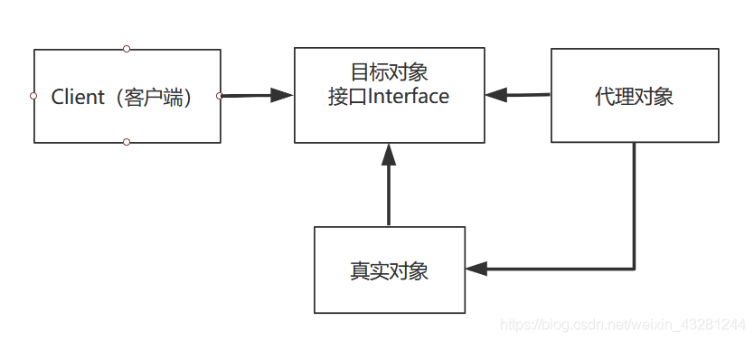
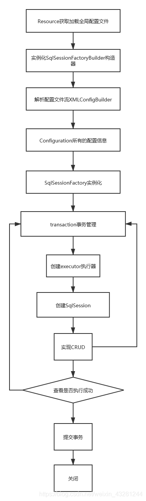

# 1、简介

## 1.1 何为Mybatis

- MyBatis 是一款优秀的**持久层框架**
- 它支持自定义 SQL、存储过程以及高级映射
- MyBatis 免除了几乎所有的 JDBC 代码以及设置参数和获取结果集的工作
- MyBatis 可以通过简单的 XML 或注解来配置和映射原始类型、接口和 Java POJO（Plain Old Java Objects，普通老式 Java 对象）为数据库中的记录
- MyBatis 本是apache的一个[开源项目](https://baike.baidu.com/item/开源项目/3406069)iBatis, 2010年这个[项目](https://baike.baidu.com/item/项目/477803)由apache software foundation 迁移到了[google code](https://baike.baidu.com/item/google code/2346604)，并且改名为MyBatis 。
- 2013年11月迁移到[Github](https://baike.baidu.com/item/Github/10145341)。

## 1.2 获取Mybatis

- maven仓库

	~~~xml
	<dependency>
	    <groupId>org.junit.jupiter</groupId>
	    <artifactId>junit-jupiter</artifactId>
	    <version>5.9.0</version>
	    <scope>test</scope>
	</dependency>
	~~~

- Github：https://github.com/mybatis/mybatis-3

- 中文文档：https://mybatis.org/mybatis-3/zh/index.html

## 1.3 持久化

数据持久化

- 持久化就是将程序的数据在持久状态和瞬时状态转化的过程
- 内存：**断电即失**
- 数据库(Jdbc)，io文件持久化。
- 生活：冷藏.罐头。

**为什么需要持久化？**

- 有一些对象，不能让它丢掉
- 内存太贵了

## 1.4 持久层

Dao层、Service层、Controller层······

- 完成持久化工作的代码块
- 层界限十分明显

## 1.5 Mybatis的作用

帮助程序员将数据存入到数据库中

- 方便
- 传统的JDBC代码太复杂了。简化。框架。自动化
- 不用Mybatis也可以。更容易上手
- 优点：
	- 简单易学
	- 灵活
	- sql和代码的分离，提高了可维护性
	- 提供映射标签，支持对象与数据库的orm字段关系映射
	- 提供对象关系映射标签，支持对象关系组建维护
	- 提供xml标签，支持编写动态sql

# 2、搭建第一个Mybatis程序

步骤：配置环境 --\> 导入Mybatis --\> 编写代码 --\> 测试

## 2.1 配置环境

### 2.1.1 搭建数据库

~~~sql
CREATE DATABASE `newDatabase`;

USE `newDatabase`;

CREATE TABLE user (
	id	INT(20) NOT NULL PRIMARY KEY,
    name	VARCHAR(30) DEFAULT NULL,
    pwd	VARCHAR(30) DEFAULT NULL
)ENGINE=INNODB DEFAULT CHARSET=utf8;

INSERT INTO `user` VALUES
    (1,'张三','123')，
    (2,'李四','123456')，
    (3,'王五','123456789')；
~~~

### 2.1.2 导入Maven依赖

~~~xml
<dependencies>
    <!--该依赖是为了解决出现slf4j报错而导入的-->
    <dependency>
        <groupId>org.slf4j</groupId>
        <artifactId>slf4j-simple</artifactId>
        <version>1.7.25</version>
        <scope>compile</scope>
    </dependency>
    <!--导入junit单元测试-->
    <dependency>
        <groupId>org.junit.jupiter</groupId>
        <artifactId>junit-jupiter</artifactId>
        <version>5.9.0</version>
        <scope>test</scope>
    </dependency>
    <!--导入mysql驱动依赖-->
    <!-- https://mvnrepository.com/artifact/mysql/mysql-connector-java -->
    <dependency>
        <groupId>mysql</groupId>
        <artifactId>mysql-connector-java</artifactId>
        <version>8.0.29</version>
    </dependency>
    <!--导入mybatis依赖-->
    <!-- https://mvnrepository.com/artifact/org.mybatis/mybatis -->
    <dependency>
        <groupId>org.mybatis</groupId>
        <artifactId>mybatis</artifactId>
        <version>3.5.6</version>
    </dependency>
</dependencies>
~~~

## 2.2 编写模块

### 2.2.1 编写Mybatis的核心配置文件

在resource包下编写此mybatis-config.xml：

~~~xml
<?xml version="1.0" encoding="UTF-8" ?>
<!DOCTYPE configuration
        PUBLIC "-//mybatis.org//DTD Config 3.0//EN"
        "http://mybatis.org/dtd/mybatis-3-config.dtd">
<configuration>
    <environments default="development">
        <environment id="development">
            <transactionManager type="JDBC"/>
            <dataSource type="POOLED">
                <property name="driver" value="com.mysql.cj.jdbc.Driver"/>
                <!--这里的文字编码一定要设置，否则中文一定会乱码-->
                <property name="url"
                          value="jdbc:mysql://localhost:3306/mysql?useSSL=false&amp;useUnicode=true&amp;characterEncoding=UTF-8"/>
                <property name="username" value="root"/>
                <property name="password" value="password"/>
            </dataSource>
        </environment>
    </environments>
    <!--注册对应的UserMapper，此步必不可少-->
    <mappers>
        <mapper resource="com/kuang/dao/UserMapper.xml"/>
    </mappers>
</configuration>
~~~

编写Mybatis工具类（MybatisUtils.java）：

~~~java
//sqlSessionFactory --> sqlSession
public class MybatisUtils {
    private static SqlSessionFactory sqlSessionFactory;
    static{
        try {
            //使用Mybatis第一步：获取sqlSessionFactory对象
            String resource = "mybatis-config.xml";
            InputStream inputStream = Resources.getResourceAsStream(resource);
            sqlSessionFactory = new SqlSessionFactoryBuilder().build(inputStream);
        } catch (IOException e) {
            e.printStackTrace();
        }
    }
    //既然有了 SqlSessionFactory，顾名思义，我们就可以从中获得 SqlSession 的实例了。
    // SqlSession 完全包含了面向数据库执行 SQL 命令所需的所有方法。
    public static SqlSession getSqlSession(){
        return sqlSessionFactory.openSession();
    }
}
~~~

## 2.3 编写代码

### 2.3.1 实体类

~~~java
public class User {
    //成员变量的名字要与mysql查询表中的字段名一致
    private String name;
    private String pwd;
    private int id;

    public User(String name, String pwd, int id) {
        this.name = name;
        this.pwd = pwd;
        this.id = id;
    }
    //getter 和 setter
    //toSring方法
}
~~~

### 2.3.2 Dao接口

~~~java
public interface UserMapper {
    List<User> getUserList();
}
~~~

### 2.3.3 接口实现类

由原来的UserDaoImpl，使用myatis后则转变为一个Mapper配置文件

~~~xml
<?xml version="1.0" encoding="UTF-8" ?>
<!DOCTYPE mapper
        PUBLIC "-//mybatis.org//DTD Mapper 3.0//EN"
        "http://mybatis.org/dtd/mybatis-3-mapper.dtd">

<!--namespace绑定一个对应的Dao/Mapper接口-->
<mapper namespace="zh.learn.pojo.UserMapper">
    <!--select查询语句，这里的id要与接口中的方法对应，resultType是返回值类型，parameterType是参数类型-->
    <select id="getUserList" resultType="zh.learn.pojo.User">
        select id, name, pwd from newDatabase.user;
    </select>
</mapper>
~~~

## 2.4 测试

### 2.4.1 测试类

```java
public class UserMapperTest {
    @Test
    public void test1() {
        SqlSession sqlSession = MybatisUtils.getSqlSession();
        //获取接口的class类，将接口与sql查询结合在一起
        UserMapper mapper = sqlSession.getMapper(UserMapper.class);
        List<User> user_list = mapper.getUserList();
        for (User user : user_list) {
            System.out.println(user);
        }
        //要关闭资源，否则有可能会出现某种错误
        sqlSession.close();
    }
}
```

注意点：

org.apache.ibatis.binding.BindingException: Type interface com.dz.dao.UserDao is not known to the MapperRegistry.

**MapperRegistry**是什么？

核心配置文件中注册 mappers（见上文mybatis-config.xml的配置）

在maven（prom.xml）中应尽量添加如下build，以避免文件目录识别错误

~~~xml
<build>
    <resources>
        <resource>
            <directory>src/main/resources</directory>
            <includes>
                <include>**/*.properties</include>
                <include>**/*.xml</include>
            </includes>
            <filtering>true</filtering>
        </resource>
        <resource>
            <directory>src/main/java</directory>
            <includes>
                <include>**/*.properties</include>
                <include>**/*.xml</include>
            </includes>
            <filtering>true</filtering>
        </resource>
    </resources>
</build>
~~~

可能遇到的问题：

1. 配置文件没有注册
2. 绑定接口错误
3. 方法名不对
4. 返回类型不对
5. Maven导出资源问题

# 3、CRUD

## 3.1 namespqce

namespqce的值要与dao或mapper中接口的包名一致

## 3.2 select

查询语句

~~~xml
<select id="getUserList" resultType="zh.learn.pojo.User">
    select id, name, pwd from newDatabase.user;
</select>
~~~

该条位于mapper中，其中的：

- id：即namespace对应接口下对应的方法名
- resultType：sql执行语句的返回值，也是id对应方法的返回值
- parameterType：id对应方法的参数


## 3.3 add、delete、update

增删改同前面的查询，只是要记得提交事务，不然更改无法生效！

~~~java
//如果使用此方法则无需提交
public static SqlSession getSqlSession(){
        return sqlSessionFactory.openSession(true);// 自动提交
    }
// 自动提交，不需要显示写SqlSession.commit();
~~~

UserMapper.xml

~~~xml
<?xml version="1.0" encoding="UTF-8" ?>
<!DOCTYPE mapper
        PUBLIC "-//mybatis.org//DTD Mapper 3.0//EN"
        "http://mybatis.org/dtd/mybatis-3-mapper.dtd">

<mapper namespace="zh.learn.pojo.UserMapper">
    <select id="getUserList" resultType="zh.learn.pojo.User">
        select id, name, pwd from newDatabase.user;
    </select>

    <select id="getUserByID" resultType="zh.learn.pojo.User" parameterType="_int">
        select id, name, pwd from newDatabase.user where id = #{id};
    </select>

    <insert id="insertUser" parameterType="zh.learn.pojo.User">
        insert into newDatabase.user(id, name, pwd) VALUES (#{id},#{name},#{pwd});
    </insert>

    <delete id="deleteByID" parameterType="_int">
        delete from newDatabase.user where id = #{id};
    </delete>

    <update id="updateUser" parameterType="zh.learn.pojo.User">
        update newDatabase.user set name = #{name}, pwd = #{pwd} where id = #{id};
    </update>
</mapper>
~~~

UserMapper.java

~~~java
public interface UserMapper {
    List<User> getUserList();

    User getUserByID(int id);

    void insertUser(User user);

    void deleteByID(int id);

    void updateUser(User user);
}
~~~

UserMapperTest.java

~~~java
public class UserMapperTest {
    @Test
    public void test1() {
        SqlSession sqlSession = MybatisUtils.getSqlSession();

        UserMapper mapper = sqlSession.getMapper(UserMapper.class);
        List<User> user_list = mapper.getUserList();

        for (User user : user_list) {
            System.out.println(user);
        }

        sqlSession.close();
    }

    @Test
    public void selectTest2() {
        SqlSession sqlSession = null;
        try {
            sqlSession = MybatisUtils.getSqlSession();
            UserMapper mapper = sqlSession.getMapper(UserMapper.class);
            User user = mapper.getUserByID(1);
            System.out.println(user);
        } finally {
            if (sqlSession != null)
                sqlSession.close();
        }
    }

    @Test
    public void insertTest() {
        SqlSession sqlSession = null;
        try {
            sqlSession = MybatisUtils.getSqlSession();
            UserMapper mapper = sqlSession.getMapper(UserMapper.class);
            mapper.insertUser(new User("王晓娟","86643215", 4));
            System.out.println("增添成功！");
            sqlSession.commit();
        } finally {
            if (sqlSession != null)
                sqlSession.close();
        }
    }

    @Test
    public void DeleteTest() {
        SqlSession sqlSession = null;
        try {
            sqlSession = MybatisUtils.getSqlSession();
            UserMapper mapper = sqlSession.getMapper(UserMapper.class);
            mapper.deleteByID(4);
            sqlSession.commit();
        } finally {
            if (sqlSession != null)
                sqlSession.close();
        }
    }

    @Test
    public void updateUserTest() {
        SqlSession sqlSession = null;
        try {
            sqlSession = MybatisUtils.getSqlSession();
            UserMapper mapper = sqlSession.getMapper(UserMapper.class);
            mapper.updateUser(new User("韩美美","772310576",4));
            System.out.println("更新成功！");
            sqlSession.commit();
        } finally {
            if (sqlSession != null)
                sqlSession.close();
        }
    }
}
~~~

## 3.4 万能Map

> 假设，我们的实体类，或者数据库中的表，字段或者参数过多，我们应该考虑使用Map。
>
> 不然需要new 对象，对面的属性就是很多，会比较麻烦。

UserMapper接口

```
public void addUser2(Map<String,Object> map);
```

UserMapper.xml

```xml
<!-- 传递map的key-->
<insert id="addUser2" parameterType="map">
    insert into user (id,name,password) values (#{userid},#{username},#{userpassword})
</insert>
 @Test
    public void test3(){
        SqlSession sqlSession = MybatisUtils.getSqlSession();
        UserMapper mapper = sqlSession.getMapper(UserMapper.class);
        HashMap<String, Object> map = new HashMap<String, Object>();
        map.put("userid",4);
        map.put("username","王虎");
        map.put("userpassword",789);
        
        mapper.addUser2(map);
        sqlSession.commit();//提交事务
        sqlSession.close();
    }
```

>Map传递参数：在sql中取出key即可！ eg：【parameter=“map”】
>
>对象传递参数：在sql中取出对象的属性即可！ 【parameter=“pojo.User”】
>
>只有一个基本类型参数的情况下：直接在sql中取到
>
>多个参数用Map , **或者注解！**

## 3.5 模糊查询

原来的sql：

```xml
SELECT * from `user` where name like '22%'
  <update id="update" parameterType="pojo.User" flushCache="false">
        update user set name = #{name} where id = #{id}
    </update>
//通配符% %（表示任意）
    List<User> queryLike(@Param("name") String name);
```

通配符可以直接输入到测试类中，转化的通配符会被自动识别。在UserMapper.xml中就应该把传入参数的类型写死，这是为了以防用户输入不合规矩的字符串。

# 4、配置解析

## 4.1 mybatis-config.xml

MyBatis 的配置文件包含了会深深影响 MyBatis 行为的设置和属性信息。 配置文档的顶层结构如下：

- configuration（配置）
	- [properties（属性）](https://mybatis.org/mybatis-3/zh/configuration.html#properties)
	- [settings（设置）](https://mybatis.org/mybatis-3/zh/configuration.html#settings)
	- [typeAliases（类型别名）](https://mybatis.org/mybatis-3/zh/configuration.html#typeAliases)
	- [typeHandlers（类型处理器）](https://mybatis.org/mybatis-3/zh/configuration.html#typeHandlers)
	- [objectFactory（对象工厂）](https://mybatis.org/mybatis-3/zh/configuration.html#objectFactory)
	- [plugins（插件）](https://mybatis.org/mybatis-3/zh/configuration.html#plugins)
	- environments（环境配置）
		- environment（环境变量）
			- transactionManager（事务管理器）
			- dataSource（数据源）
	- [databaseIdProvider（数据库厂商标识）](https://mybatis.org/mybatis-3/zh/configuration.html#databaseIdProvider)
	- mappers（映射器）

## 4.2 environmets（环境配置）

在标签environments中可以配置多个environment，通过设置environments中default参数值（其值为environment的ID）来指定所要选择的环境。所以mybatis可以配置多种环境

**不过要记住：尽管可以配置多个环境，但每个SqlSessionFactory实例只能选择一种环境**

Mybatis默认的事务管理器就是JDBC，使用连接池：POOLED

### sqlSession

在java测试类中，我们使用sqlSessionFactoryBuilder这个类来生成sqlSessionFactory类，一旦sqlSessionFactory生成完毕，sqlSessionFactoryBuilder这个实例就失去了作用，可以被抛弃。

相反，sqlSessionFactory可以一直存在，**没有任何理由丢弃它或重新创建另一个实例**。其可以被想象成数据库连接池，因此SqlSessionFactory 的最佳作用域是应用作用域，也正是因为如此，在程序中反复、多次创建工厂类实例是一种不好的行为。它用来提供sqlSession实例，其可以创建多个SqlSession实例。最简单的就是使用单例模式或是静态单例模式

**SqlSession**是连接到数据库连接池的一个请求，但是它不是线程安全的，不能被共享，所以它的最佳的作用域是请求或方法作用域。一个SqlSession可以创建多个Mapper实例，一个Mapper就代表一个业务，一个SqlSession可以当作一台机器。当然，一个sqlSession实例也可以直接通过扫描包装类的方式直接执行。该机器（实例）使用完后就应该被关闭，送回工厂进行回收。

## 4.3 properties（属性）

这些属性可以在外部进行配置，并可以进行动态替换。你既可以在典型的 Java 属性文件中配置这些属性，也可以在 properties 元素的子元素中设置。

设置好的属性可以在整个配置文件中用来替换需要动态配置的属性值。

db.properties：

~~~properties
driver=com.mysql.cj.jdbc.Driver
url=jdbc:mysql://localhost:3306/mysql?useSSL=false&amp;useUnicode=true&amp;characterEncoding=UTF-8
username=root
password=root
~~~

mybatis-config.xml的配置：


上图为在配置中个属性的顺序（必须按照这个顺序来！）

~~~xml
<!--引入外部配置文件-->
<properties resource="db.properties"/>
~~~

- 可以直接引入外部文件
- 可以在其中增加一些属性配置
- 如果两个文件有同一个字段，首先读取在properties元素体内指定的属性，然后根据 properties 元素中的 resource 属性读取类路径下属性文件，或根据 url 属性指定的路径读取属性文件，并覆盖之前读取过的同名属性，最后读取作为方法参数传递的属性，并覆盖之前读取过的同名属性（优先使用外部配置文件的）

## 4.4 typeAliases（类型别名）

- 类型别名是为Java类型设置一个短的名字
- 存在的意义仅在于用来减少类完全限定名的冗余

~~~xml
<!--可以给实体类起别名-->
<typeAliases>
    <typeAlias type="com.dz.pojo.User" alias="User"></typeAlias>
</typeAliases>
~~~

也可以指定一个包名，MyBatis 会在包名下面搜索需要的 Java Bean，比如：

扫描实体类的包，它默认别名就为这个类的类名（首字母小写）

```xml
<!--可以给实体类起别名-->
<typeAliases>
    <package name="com.dz.pojo"/>
</typeAliases>
```

在实体类比较少的时候，使用第一种方式

如果实体类较多，使用第二种方式

第一种可以自定义别名，第二种不行，如果非要改，需要在实体类上增加注解

```java
@Alias("user")
public class User {}
```

**这里不推荐起别名的方式，原因是当你程序报错时，你要去寻找具体报错的包/类时，会相当麻烦**

## 4.5 setting（设置）

这是 MyBatis 中极为重要的调整设置，它们会改变 MyBatis 的运行时行为


## 4.6、其他设置

- [typeHandlers（类型处理器）](https://mybatis.org/mybatis-3/zh/configuration.html#typeHandlers)
- [objectFactory（对象工厂）](https://mybatis.org/mybatis-3/zh/configuration.html#objectFactory)
- plugins插件
	- mybatis-generator-core
	- mybatis-plus
	- 通用mapper

## 4.7、映射器（mappers）

MapperRegistry：注册绑定我们的Mapper文件

方式一：【推荐使用】

```xml
<mappers>
	<mapper resource="com/dz/dao/UserMapper.xml"></mapper>
</mappers>
```

方式二：使用class文件绑定注册

```xml
<mappers>
	<mapper class="com.dz.dao.UserMapper"></mapper>
</mappers>
```

方式二注意点：

- 接口和他的Mapper配置文件必须同名
- 接口和他的Mapper配置文件必须在同一包下

方式三：使用扫描包进行注入绑定

```xml
<mappers>
	<package name="com.dz.dao"></package>
</mappers>
```

方式三注意点：

- 接口和他的Mapper配置文件必须同名
- 接口和他的Mapper配置文件必须在同一包下

## 4.8 生命周期与作用域

详见4.2章节的sqlSession章节。

# 5、解决属性名和字段名不一致的问题

## 5.1 问题描述

当我们的User实体类中的成员变量（属性）与Mysql中相应的字段名不匹配时，在读取的时候对应的成员变量就会发生读取为空的情况（无法成功读取）

## 5.2 起别名

~~~xml
<select id="getUserById" parameterType="int" resultType="com.dz.pojo.User">
        select id,name,pwd as password from user where id = #{id}
</select>
~~~

使用sql语句起一个与User实体类属性一致的别名即可解决问题。在测试的时候发现，**只要User实体类中set方法的方法名对应即可**。如：MySQL中的字段名为pwd，在User实体类中的字段名为password，那么只要password的set方法方法名为setPassword即可。

## 5.3 resultMap

结果集映射

```xml
<!--字段名-->
id	name	pwd
<!--实体类中的属性名-->
id	name	password
<!--结果集映射-->
<!--type的参数是实体类-->
<resultMap id="UserMap" type="User">
    <!--column数据库中的字段，property实体类中的属性，-->
    <result column="id" property="id"></result>
    <result column="name" property="name"></result>
    <result column="pwd" property="password"></result>
</resultMap>

<select id="getUserById" parameterType="int" resultMap="UserMap">
    select * from user where id = #{id}
</select>
```

- `resultMap` 元素是 MyBatis 中最重要最强大的元素
- ResultMap 的设计思想是，对简单的语句做到零配置，对于复杂一点的语句，只需要描述语句之间的关系就行了
- `resultMap`最优秀的地方在于，虽然你已经对它相当了解了，但是根本就不需要显式地用到它们

# 6、日志

## 6.1 日志工厂

如果一个数据库操作出现了异常，我们需要排错。日志就是最好的助手！

曾经：sout、debug（原始的手动调试方式）

现在：日志工厂

日志工厂logImpl这一属性是位于settings下的（详见第四章配置解析中settings的描述），默认值有：

- SLF4J（这个只是提供了API接口，没有具体实现）
- LOG4J（3.5.9 起废弃）
- LOG4J2（发生过重大安全漏洞2021，现已修复）【掌握】
- JDK_LOGGING
- COMMONS_LOGGING
- STDOUT_LOGGING（最基本的日志工厂，功能少）【掌握】
- NO_LOGGING（即无需日志的意思）

## 6.2 STDOUT_LOGGING

标准日志输出。需要在mybatis-config.xml中的settings下设置。

~~~xml
<settings>
        <setting name="logImpl" value="STDOUT_LOGGING"/>
</settings>
~~~

其他不发生改变，按原步骤执行即可。

## 6.3 Log4j2

什么是LOG4j？

- Log4j是[Apache](https://baike.baidu.com/item/Apache/8512995)的一个开源项目，通过使用Log4j，我们可以控制日志信息输送的目的地是[控制台](https://baike.baidu.com/item/控制台/2438626)、文件、[GUI](https://baike.baidu.com/item/GUI)组件
- 我们也可以控制每一条日志的输出格式
- 通过定义每一条日志信息的级别，我们能够更加细致地控制日志的生成过程
- 通过一个[配置文件](https://www.jianshu.com/p/bfc182ee33db)来灵活地进行配置，而不需要修改应用的代码

### 6.3.1 导包

~~~xml
<!-- https://mvnrepository.com/artifact/org.apache.logging.log4j/log4j-core -->
<dependency>
    <groupId>org.apache.logging.log4j</groupId>
    <artifactId>log4j-api</artifactId>
    <version>2.18.0</version>
</dependency>
<dependency>
    <groupId>org.apache.logging.log4j</groupId>
    <artifactId>log4j-core</artifactId>
    <version>2.18.0</version>
</dependency>
~~~

具体在何处配置该项依赖，作者就不再赘述了。

### 6.3.2 配置Log4j2

由于log4j2升级了，其不再支持properties文件，现在其标准的配置文件为log4j2.xml。

log4j2默认会在classpath目录下寻找log4j2.xml、log4j.json、log4j.jsn等名称的文件。 **系统选择配置文件的优先级(从先到后)如下**：

1. .classpath下的名为log4j2-test.json 或者log4j2-test.jsn的文件.

2. .classpath下的名为log4j2-test.xml的文件.

3. .classpath下名为log4j2.json 或者log4j2.jsn的文件.

4. .classpath下名为log4j2.xml的文件

**我们一般默认使用log4j2.xml进行命名。**当然，平时我们一般使用log4j2.xml。

~~~xml
<?xml version="1.0" encoding="UTF-8"?>
<!--日志级别以及优先级排序: OFF > FATAL > ERROR > WARN > INFO > DEBUG > TRACE > ALL -->
<!--Configuration后面的status，这个用于设置log4j2自身内部的信息输出，可以不设置，当设置成trace时，你会看到log4j2内部各种详细输出-->
<!--monitorInterval：Log4j能够自动检测修改配置 文件和重新配置本身，可设置一个非零的间隔秒数来检测配置变更 -->
<!--https://www.jianshu.com/p/bfc182ee33db -->
<Configuration status="WARN" monitorInterval="60">
    <!-- 自定义一些变量 -->
    <Properties>
        <!-- 变量定义 -->
        <Property name="log_base_dir">/app_data/logs/my_app</Property>
        <!-- Appender在将日志数据写入目标位置之前，一般会将日志数据通过Layout进行格式化。PatternLayout可以使用与C语言printf函数类似
        的转换模式来指定输出格式。常见的配置如下：
        - %d{yyyy-MM-dd HH:mm:ss.SSS} : 日志生成时间，输出格式为“年-月-日 时:分:秒.毫秒”
        - %p : 日志输出格式
        - %c : logger的名称
        - %m : 日志内容，即 logger.info("message")
        - %n : 换行符
        - %T : 线程号
        - %L : 日志输出所在行数
        - %M : 日志输出所在方法名 -->
        <Property name="log_pattern">[%d{yyyy-MM-dd HH:mm:ss.SSS}][%-5p][%T][%c.%M:%L] %msg%xEx%n</Property>
        <!-- 单个日志文件最大大小，单位可以是KB, MB or GB -->
        <Property name="max_single_file_size">1MB</Property>
    </Properties>

    <!-- 使用Appenders元素可以将日志事件数据写到各种目标位置（目前可以为控制台、文件、多种数据库API、远程套接字服务器、Apache Flume、
    JMS、远程UNIX Syslog daemon），其内的每个Appender都必须要有一个name属性作为唯一标识，该标识的值在Logger中通过AppenderRef来引
    用，从而将该Appender配置到该Logger中 -->
    <Appenders>
        <!-- Console Appender常用于将日志输出到System.out，一般用在开发环境 -->
        <Console name="Console" target="SYSTEM_OUT">
            <!-- 只接受程序中DEBUG级别的日志进行处理-->
            <ThresholdFilter level="DEBUG" onMatch="ACCEPT" onMismatch="DENY"/>
            <!-- 在大多数情况下，Appender将格式化LogEvent的责任委托给Layout -->
            <PatternLayout pattern="${log_pattern}"/>
        </Console>

        <!-- RollingFile Appender会将日志输出到fileName属性指定的文件中，且需要指定TriggeringPolicy和RolloverStrategy。其中
        TriggeringPolicy决定是否生成新的日志文件，RolloverStrategy决定如何生成新的日志文件。如果没有配置RolloverStrategy，则会
        使用DefaultRolloverStrategy。从2.5开始，可以在DefaultRolloverStrategy中配置一个自定义的删除动作。从2.8开始，如果没有指定
        文件名，则会使用DirectWriteRolloverStrategy来代替DefaultRolloverStrategy -->
        <!-- 这个RollingFile Appender会打印出所有的DEBUG及以下级别（DEBUG、INFO、ERROR、FATAL、OFF）的信息 -->
        <RollingFile name="DebugLogRollingFile" fileName="${log_base_dir}/my_app_debug.log"
                     filePattern="${log_base_dir}/$${date:yyyy_MM_dd}/my_app_debug_%d{yyyy_MM_dd_HH}_%i.log.gz">
            <ThresholdFilter level="DEBUG" onMatch="ACCEPT" onMismatch="DENY"/>
            <PatternLayout pattern="${log_pattern}" charset="UTF-8"/>
            <!-- Policies表示一个CompositeTriggeringPolicy，可以组合多个TriggeringPolicy，只要内部的任意一个TriggeringPolicy
            满足触发条件，都会滚动日志 -->
            <Policies>
                <!-- TimeBasedTriggeringPolicy用于按时间滚动日志。只要filePattern属性值中的日期/时间模式（pattern）不再应用于当
                前文件时就进行日志滚动。这种规则通过interval和modulate属性来配置。interval属性指定一个整数，用于基于日期/时间模式中
                的最小的时间单位数滚动一次。例如，filePattern值为/app_data/logs/my_app/$${date:yyyy_MM_dd}/my_app_%d{yyyy_
                MM_dd_HH}_%i.log，这里使用小时作为最小的时间单位时，假如interval参数值为4，则表示每4小时滚动一次。默认值为1。
                modulate表示是否调整interval属性值以便下次滚动发生在interval边界处。如果时间最小单位为小时，当前时间为早上3点，间隔
                为4小时，则第一次滚动将发生在早上4点时（而不是早上7点），后续滚动将发生在早上8点、中午12点、下午4点等时刻 -->
                <TimeBasedTriggeringPolicy interval="1" modulate="false"/>
                <!-- SizeBasedTriggeringPolicy用于按文件大小滚动日志。每当日志文件超过size指定的大小（一般不超过几十MB，否则使用软
                件打开导出的日志时很不方便），则这size大小的日志会自动存入按filePattern属性指定建立的文件夹下面并进行压缩存档 -->
                <SizeBasedTriggeringPolicy size="${max_single_file_size}"/>
            </Policies>
            <!-- DefaultRolloverStrategy可以同时接受RollingFileAppender中filePattern属性值中日期/时间和整数计数器（%i）的
            pattern，当日期/时间满足条件时，则会使用当前的日期/时间生成新的日志文件，如果filePattern属性值中含有一个整数计数器%i，则
            在每次滚动时该整数都会增加，如果filePattern属性值中同时包含了日期/时间和整数计数器（%i），计数器会在日期/时间不变时而满足
            其他滚动触发条件时（文件大小）开始自增，直到日期/时间发生变化时，计数器会重新自增。以.gz、.zip、.bz2、deflate、pack200
            或xz结尾的filePattern值，会在日志文件归档时以后缀对应的格式进行压缩。min属性指定计数器的最小值，默认为1。max属性指定计数
            器的最大值，一旦计数器达到了最大值，最早的归档将会在每次滚动时被删除，默认值为7。fileIndex属性如果设置为max（默认），则具
            有更大索引的文件比具有更小索引的文件内容更新，如果设置为min，文件将重命名且计数器将遵循Fixed Window策略，这两种情况均有可
            能导致批量的文件重命名，自2.8版本开始，如果fileIndex属性设置为nomax，则min和max属性值都将会被忽略，文件编号将每次递增1，
            每次滚动都会递增到更大的值，且没有最大文件编号的限制 -->
            <!--<DefaultRolloverStrategy max="100" min="1" fileIndex = "nomax"/>-->
            <DefaultRolloverStrategy fileIndex="nomax">
                <!-- Log4j 2.5引入了删除动作（Delete元素）。在滚动删除旧的日志文件时，相比使用DefaultRolloverStrategy的max属
                性，该功能可以让用户拥有更多的删除控制。删除动作可以让用户配置若干个条件来删除相对于基准目录的文件。该功能可以删除非日
                志文件，使用时一定要小心。可以通过testMode属性来测试配置是否会错删文件。basePath属性值用于指定删除文件的基准目录，必
                须显式指定。maxDepth属性指定扫描目录的最大层级，0表示仅能访问基准目录（安全限制不能访问的情况除外），
                Integer.MAX_VALUE值表示可以访问所有层级。默认值为1，表示仅扫描基准目录下的文件。testMode属性值如果设置为true，文件
                不会实际删除，而是在status logger打印一条INFO级别的消息，可以使用该功能来测试是否会错删目标文件，默认为false。-->

                <!-- 这里的Delete元素配置了每次滚动都会删除基准目录下匹配“*/my_app_debug_*.log.gz”日志文件，只要9分钟以前的日志文
                件总大小超过2MB，或9分钟以前的日志文件文件总数超过2个就按时间顺序删除较早的日志文件。该元素可以防止日志文件所在分区的
                磁盘空间被占满。特别需要注意的是，只有在发生日志滚动时才会尝试进行删除，否则即使满足了删除条件，但如果没有新的滚动日志
                生成的话也不会发生删除操作。 -->
                <Delete basePath="${log_base_dir}" maxDepth="2">
                    <!-- Delete元素里可以指定若干个PathCondition类型的元素。如果指定了不止一个条件，则这些条件都需要在删除之前接受
                    某个路径。这些条件可以嵌套，只有外部条件接受某个路径之后，其内部条件才会决定是否接受该路径。如果这些条件没有嵌套，
                    则它们的执行顺序是任意的。这些条件也可以通过使用IfAll, IfAny和IfNot等组合条件进行AND、OR和NOT等逻辑运算。用户
                    也可以创建自定义条件或使用内置条件：
                    - IfFileName：接受匹配正则表达式或glob的文件路径；
                    - IfLastModified：接受比指定时段早或一样早的文件；
                    - IfAccumulatedFileCount：在遍历文件树时文件总数超过文件数上限后接受路径；
                    - IfAccumulatedFileSize：在遍历文件树时文件总大小超过上限后接受路径；
                    - IfAll：如果所有内嵌条件都接受了某个路径才会接受该路径，相当于AND逻辑，其内嵌条件的执行顺序是任意的；
                    - IfAny：如果任意一个内嵌条件接受了某个目录就接受该目录，相当于OR逻辑，其内嵌条件的执行顺序是任意的；
                    - IfNot：如果内嵌条件不接受某个路径就接收该路径，相当于NOT逻辑。-->

                    <!-- IfFileName可以通过glob（使用受限的模式语言,比正则更简单）或regex属性（正则）来匹配相对路径（相对于Delete
                    的basePath属性指定的基准目录）-->
                    <!-- 当外部的条件满足时才会计算内部的条件，内部的同级条件的计算顺序是任意的。 -->
                    <IfFileName glob="*/my_app_debug_*.log.gz">
                        <!-- IfLastModified可以通过age属性值来指定接受最后修改时间为指定时间或早于指定时间的路径，该属性的值可参考
                        org.apache.logging.log4j.core.appender.rolling.action.Duration.parse(CharSequence text)方法的文档 -->
                        <!-- 这里的IfLastModified指定删除达到或超过60天内的文件 -->
                        <IfLastModified age="9m">
                            <!-- 这里的IfAny内嵌了两个PathCondition，表示满足任意一个条件即可 -->
                            <IfAny>
                                <!-- IfAccumulatedFileSize可通过exceeds属性值指定一个文件总大小上限值。如果文件数超过了该上限值
                                则删除文件 -->
                                <IfAccumulatedFileSize exceeds="2MB"/>
                                <!-- IfAccumulatedFileCount可通过exceeds属性值指定一个文件总数上限值。如果文件数超过了该上限值
                                则删除文件 -->
                                <IfAccumulatedFileCount exceeds="2"/>
                            </IfAny>
                        </IfLastModified>
                    </IfFileName>
                </Delete>
            </DefaultRolloverStrategy>
        </RollingFile>

        <RollingFile name="InfoLogRollingFile" fileName="${log_base_dir}/my_app_info.log"
                     filePattern="${log_base_dir}/$${date:yyyy_MM_dd}/my_app_info_%d{yyyy_MM_dd_HH}_%i.log.gz">
            <ThresholdFilter level="INFO" onMatch="ACCEPT" onMismatch="DENY"/>
            <PatternLayout pattern="${log_pattern}"/>
            <Policies>
                <TimeBasedTriggeringPolicy/>
                <SizeBasedTriggeringPolicy size="${max_single_file_size}"/>
            </Policies>
            <DefaultRolloverStrategy fileIndex="nomax">
                <Delete basePath="${log_base_dir}" maxDepth="2">
                    <IfFileName glob="*/my_app_info_*.log.gz">
                        <!-- 这里表示匹配“*/my_app_info_*.log.gz”模式的日志文件的删除策略如下：
                        - 只要日志文件总数量超过5个就删除按时间顺序最早的日志文件
                        - 只要日志文件总大小超过10MB就会删除按时间顺序最早的日志文件
                        - 只要日志文件最近修改时间为9分钟前或更早就会删除按时间顺序最早的日志文件 -->
                        <IfAny>
                            <IfAccumulatedFileSize exceeds="8MB"/>
                            <IfAccumulatedFileCount exceeds="5"/>
                            <IfLastModified age="9m"/>
                        </IfAny>
                    </IfFileName>
                </Delete>
            </DefaultRolloverStrategy>
        </RollingFile>

        <RollingFile name="WarnLogRollingFile" fileName="${log_base_dir}/my_app_warn.log"
                     filePattern="${log_base_dir}/$${date:yyyy_MM_dd}/my_app_warn_%d{yyyy_MM_dd_HH}_%i.log.gz">
            <ThresholdFilter level="WARN" onMatch="ACCEPT" onMismatch="DENY"/>
            <PatternLayout pattern="${log_pattern}"/>
            <Policies>
                <TimeBasedTriggeringPolicy/>
                <SizeBasedTriggeringPolicy size="${max_single_file_size}"/>
            </Policies>
            <DefaultRolloverStrategy fileIndex="nomax">
                <Delete basePath="${log_base_dir}" maxDepth="2">
                    <IfFileName glob="*/my_app_warn_*.log.gz">
                        <IfAny>
                            <IfAccumulatedFileSize exceeds="3GB"/>
                            <IfAccumulatedFileCount exceeds="3000"/>
                            <IfLastModified age="30d"/>
                        </IfAny>
                    </IfFileName>
                </Delete>
            </DefaultRolloverStrategy>
        </RollingFile>

        <RollingFile name="ErrorLogRollingFile" fileName="${log_base_dir}/my_app_error.log"
                     filePattern="${log_base_dir}/$${date:yyyy_MM_dd}/my_app_error_%d{yyyy_MM_dd_HH}_%i.log.gz">
            <ThresholdFilter level="ERROR" onMatch="ACCEPT" onMismatch="DENY"/>
            <PatternLayout pattern="${log_pattern}"/>
            <Policies>
                <TimeBasedTriggeringPolicy/>
                <SizeBasedTriggeringPolicy size="${max_single_file_size}"/>
            </Policies>
            <DefaultRolloverStrategy fileIndex="nomax">
                <Delete basePath="${log_base_dir}" maxDepth="2">
                    <IfFileName glob="*/my_app_error_*.log.gz">
                        <IfAny>
                            <IfAccumulatedFileSize exceeds="3GB"/>
                            <IfAccumulatedFileCount exceeds="3000"/>
                            <IfLastModified age="30d"/>
                        </IfAny>
                    </IfFileName>
                </Delete>
            </DefaultRolloverStrategy>
        </RollingFile>

        <!-- 记录druid的SQL语句 -->
        <RollingFile name="DruidSqlRollingFile" fileName="${log_base_dir}/druid.log"
                     filePattern="${log_base_dir}/$${date:yyyy_MM_dd}/druid_%d{yyyy_MM_dd_HH}_%i.log.gz">
            <PatternLayout pattern="${log_pattern}"/>
            <Policies>
                <TimeBasedTriggeringPolicy/>
                <SizeBasedTriggeringPolicy size="${max_single_file_size}"/>
            </Policies>
            <DefaultRolloverStrategy fileIndex="nomax">
                <Delete basePath="${log_base_dir}" maxDepth="2" testMode="true">
                    <IfFileName glob="*/druid_*.log.gz">
                        <IfAny>
                            <IfAccumulatedFileSize exceeds="3GB"/>
                            <IfAccumulatedFileCount exceeds="3000"/>
                            <IfLastModified age="30d"/>
                        </IfAny>
                    </IfFileName>
                </Delete>
            </DefaultRolloverStrategy>
        </RollingFile>
    </Appenders>

    <!--定义logger，只有定义了logger并引入的appender，appender才会生效-->
    <Loggers>
        <!-- 当Logger在配置文件中声明时，就创建了一个LoggerConfig对象，两者一一对应，LoggerConfig包含一些Filter、这些
        Filters用于过滤传递给任意Appender的LogEvent，它还包含一些Appender的引用。Logger本身执行无指向的动作，它仅含有一
        个与LoggerConfig关联的名称（通过name属性指定），root Logger具有固定的默认名称，其他Logger需要指定各自的name属性
        值。LoggerConfig会被分配一个日志级别，通过level属性来指定。内建的日志级别按优先级从高到底排序有：OFF > FATAL >
        ERROR > WARN > INFO > DEBUG > TRACE > ALL，Log4j 2 也支持自定义的日志级别。
        -->
        <Root level="ALL">
            <AppenderRef ref="Console"/>
            <AppenderRef ref="InfoLogRollingFile"/>
            <AppenderRef ref="WarnLogRollingFile"/>
            <AppenderRef ref="DebugLogRollingFile"/>
            <AppenderRef ref="ErrorLogRollingFile"/>
        </Root>

        <!-- 每个LoggerConfig的日志级别如果没有显式配置，则会继承其父级LoggerConfig的日志级别，而root LoggerConfig如果没
        有配置日志级别，则会为其分配一个默认的ERROR级别 -->
        <!-- 某个Logger所允许的每条日志打印请求都会传递给其LoggerConfig中的所有Appender，也会传递给该LoggerConfig的parent
        LoggerConfig中的Appender，这种现象称为相加性（Additivity）。也就是说，Appender会从LoggerConfig的继承中继承相加性。这种特
        性可以用来汇整某几个logger的输出，可以在声明Logger的配置文件中设置additivity="false"来禁用这种叠加继承 -->
        <!--记录druid-sql的记录-->
        <Logger name="druid.sql.Statement" level="debug" additivity="false">
            <appender-ref ref="DruidSqlRollingFile"/>
        </Logger>

        <!--过滤掉spring和mybatis的一些无用的DEBUG信息-->
        <Logger name="org.springframework" level="INFO"/>
        <Logger name="org.mybatis" level="INFO"/>

        <!--log4j2 自带过滤日志-->
        <Logger name="org.apache.catalina.startup.DigesterFactory" level="error"/>
        <Logger name="org.apache.catalina.util.LifecycleBase" level="error"/>
        <Logger name="org.apache.coyote.http11.Http11NioProtocol" level="warn"/>
        <Logger name="org.apache.sshd.common.util.SecurityUtils" level="warn"/>
        <Logger name="org.apache.tomcat.util.net.NioSelectorPool" level="warn"/>
        <Logger name="org.crsh.plugin" level="warn"/>
        <Logger name="org.crsh.ssh" level="warn"/>
        <Logger name="org.eclipse.jetty.util.component.AbstractLifeCycle" level="error"/>
        <Logger name="org.hibernate.validator.internal.util.Version" level="warn"/>
        <Logger name="org.springframework.boot.actuate.autoconfigure.CrshAutoConfiguration" level="warn"/>
        <Logger name="org.springframework.boot.actuate.endpoint.jmx" level="warn"/>
        <Logger name="org.thymeleaf" level="warn"/>
    </Loggers>
</Configuration>
~~~

### 6.3.3 配置settings为log4j实现

~~~xml
<!--mybatis-config.xml-->
<settings>
	<setting name="logImpl" value="LOG4J2"></setting>
</settings>
~~~

### 6.3.4 测试

像之前一样正常测试、运行即可，日志会自动根据配置输出（控制台或者日志文件）

# 7、分页

为什么要分页？

- 减少数据的处理量

## 7.1 使用Limit进行分页

~~~sql
SELECT * FROM NEWDATABASES.USER LIMIT STARTINDEX,PAGESIZE;
~~~

使用Mybatis实现分页，核心SQL

1. UserMapper.java（接口）

	~~~java
	List<User> getUserByLimit(Map<String,Integer> map);
	~~~

2. UserMapper.xml

	```xml
	<!--resultMap的设置见5.3章节的设置-->
	<select id="getUserByLimit" resultMap="UserMap" parameterType="map">
	    select * from newDatabases.user limit #{startIndex},#{pageSize};
	</select>
	```

3. 测试

	~~~java
	@Test
	public void getUserByLimitTest() {
	    SqlSession sqlSession = MybatisUtils.getSqlSession();
	    UserMapper mapper = sqlSession.getMapper(UserMapper.calss);
	    
	    Map<String,Integer> map = new HashMap<String,Integer>();
	    map.put("startIndex",1);
	    map.put("pageSize",2);
	    
	    List<User> userList = mapper.getUserByLimit(map);
	    for (User user : userList)
	        System.out.println(user);
	    
	    sqlSession.close();
	}
	~~~

## 7.2、RowBounds分页

不再使用limit进行分页

1. 接口

	~~~java
	List<User> getUserByRowBounds();
	~~~

2. UserMapper.xml

	~~~xml
	<select id="getUserByRowBounds" resultMap="UserMap">
	    select * from newDatabases.user;
	</select>
	~~~

3. 测试

	~~~java
	@Test
	public void getUserByRowBoundsTest() {
	    SqlSession sqlSession = MybatisUtils.getSqlSession();
	    RowBounds rowBounds = new rowBounds(1,2);
	    
	    <!--这种方式与先前的其他sql操作联动不同，要多加注意-->
	    List<User> userList = sqlSession.selectList("zh.learn.pojo.UserMapper.getUserByRowBounds",null,rowBounds);
	    
	    for (User user : userList)
	        System.out.println(user);
	    sqlSession.close();
	}
	~~~

## 7.3 分页插件

PageHelper：这个插件能够帮助我们实现分页查询，但我们仅作了解即可。

# 8、 使用注解开发

## 8.1 面向接口开发

大家之前都学过面向对象编程，也学习过接口，但在真正的开发中，很多时候我们会选择面向接口编程

**根本原因：解耦，可拓展，提高复用，分层开发中，上层不用管具体的实现，大家都遵守共同的标准，使得开发变得容易，规范性更好**

在一个面向对象的系统中，系统的各种功能是由许许多多的不同对象协作完成的。在这种情况下，各个对象内部是如何实现自己的，对系统设计人员来讲就不那么重要了

而各个对象之间的协作关系则成为了系统设计的关键。小到不同类之间的通信，大到各模块之间的交互，在系统设计之初都是要着重考虑的，这也是系统设计的主要工作内容。面向接口编程就是指按照这种思想来编程。

**关于接口的理解**

- 接口从更深层次的理解，应是定义（规范，约束）与实现（名实分离的原则）的分离
- 接口的本身反映了系统设计人员对系统的抽象理解

接口应有两类：

- 第一类是对一个个体的抽象，它可对应为一个抽象体（abstract class）
- 第二类是对一个个体某一方面的抽象，即形成一个抽象面（interface）
- 一个个体有可能有多个抽象面。抽象体与抽象面是由区别的。

**三个面向区别**

- 面向对象是指，我们考虑问题时，以对象为单位，考虑它的属性和方法
- 面向过程是指，我们考虑问题时，以一个具体的流程（事务过程）为单位，考虑它的实现
- 接口设计与非接口设计是针对复用技术而言的，与面向对象（过程）不是一个问题，更多的体现就是对系统整体的架构

## 8.2 使用注解开发

1. 注解在接口上实现

	~~~java
	@Select("select * from user")
	List<User> getUsers();
	~~~

	

2. 需要在核心配置文件中绑定接口

	```java
	<!--绑定接口-->
	<mappers>
	    <mapper class="com.dz.dao.UserMapper"/>
	</mappers>
	```

	注意，一旦这样绑定成功，那么之前配置的mapper.xml就会失效。在mapper.xml中mapper属性namespace绑定的就是接口，也就是说我们无需在接口中实现方法，而是在xml中进行重写（这样做更方便）。

3. 测试（同之前的测试类，不变）

- 本质：反射机制实现
- 底层：动态代理



**MyBatis详细执行流程**



## 8.3 注解CRUD

这个配置与上一小章节同，了解即可，真正开发的时候都是使用xml进行配置。

## 8.4 注意点

**关于@Param()注解**

- 基本类型的参数或是String类型，需要加上
- 引用类型不需要加
- 如果只有一个基本类型的话，可以忽略
- 在SQL中引用的就是这里的@Param()中设定的属性名

**#{} 和 ${}区别**

# 9、Lombok

Lombok项目是一个Java库，它会自动插入编辑器和构建工具中，Lombok提供了一组有用的注释，用来消除Java类中的大量样板代码。仅五个字符(@Data)就可以替换数百行代码从而产生干净，简洁且易于维护的Java类

使用步骤：

- 安装IDEA的插件（新版的IDEA已经是捆绑安装了）

- 导入依赖项

	~~~xml
	<!-- https://mvnrepository.com/artifact/org.projectlombok/lombok -->
	<dependency>
	    <groupId>org.projectlombok</groupId>
	    <artifactId>lombok</artifactId>
	    <version>1.18.22</version>
	    <scope>provided</scope>
	</dependency>
	~~~

	如果有时候始终无法使用注解（如：@Data、@Test）时，可以始终去掉依赖中的<scope\>这一属性（删除后，默认作用域为全局）

## 9.1 包含的注解


```java
@Getter and @Setter
@FieldNameConstants
@ToString
@EqualsAndHashCode
@AllArgsConstructor, @RequiredArgsConstructor and @NoArgsConstructor
@Log, @Log4j, @Log4j2, @Slf4j, @XSlf4j, @CommonsLog, @JBossLog, @Flogger, @CustomLog
@Data
@Builder
@SuperBuilder
@Singular
@Delegate
@Value
@Accessors
@Wither
@With
@SneakyThrows
@val
```

## 9.2 使用

我们常用的注解也就几个，有些注解可以根据名字来推测。@Data这一注解帮助创建无参构造、getter和setter方法、toString方法、equals和hashcode方法、compareTo方法等等必要的方法。要想既要无参又要有参构造方法，应同时使用@Data、@AllArgsConstructor和@NoArgsConstructor。

**应该注意的是**如果在共同开发的过程中，因为这个依赖的侵入性太强，如果有一人使用Lombok，那么所有人都要启用此依赖。这对新手不友好。

# 10、多对一处理

多个学生对应一个老师

## 10.1 测试环境的搭建

1. 导入lombok
2. 新建实体类Teacher,Student
3. 建立Mapper接口
4. 建立Mapper.xml文件
5. 在核心配置文件中绑定注册我们的Mapper接口或者文件 【方式很多，随心选】
6. 测试查询是否能够成功

## 10.2 按照查询嵌套处理【复杂】

**这种方式就是相当于select查询中的子查询。**

```sql
select s.id, s.name, (select t.name from teacher t where t.id = s.tid) as teach from student s;
```

### 10.2.1 实体类

~~~java
@Data
@AllArgsConstructor
@NoArgsConstructor
public class Student {
    private String name;
    private String id;
    private Teacher teacher;
}
~~~

~~~java
@Data
@AllArgsConstructor
@NoArgsConstructor
public class Teacher {
    private String name;
    private String id;
}
~~~

### 10.2.2 接口

~~~java
public interface StudentMapper {
    List<Student> getStudent();
}

public interface TeacherMapper {
    //..............
}
~~~

### 10.2.3 配置文件

StudentMapper.xml

~~~xml
<?xml version="1.0" encoding="UTF-8" ?>
<!DOCTYPE mapper
        PUBLIC "-//mybatis.org//DTD Mapper 3.0//EN"
        "http://mybatis.org/dtd/mybatis-3-mapper.dtd">

<!--绑定接口-->
<mapper namespace="zh.pojo.Mapper">
    <select id="getStudent" resultMap="StudentTeacher">
        select * from newDatabase.student;
    </select>
    
    <resultMap id="StudentTeacher" type="zh.pojo.Student">
        <result property="id" column="id"/>
        <result property="name" column="name"/>
        <!--对象（属性）用association，集合用collection-->
        <association property="teacher" column="tid" javaType="zh.pojo.Teacher"
                     select="getTeacherByID"/>
    </resultMap>
    
    <!--在StduentMapper接口中并没有此方法，我们使用xml配置了该方法，这个方法是我们新建的，不是在TeacherMapper中！-->
    <select id="getTeacherByID" parameterType="String" resultType="zh.pojo.Teacher">
        select * from newDatabase.teacher where id = #{id};
    </select>
</mapper>
~~~

在mybatis-config.xml中设置

~~~xml
<mappers>
    <mapper resource="zh/pojo/Mapper.xml"/>
</mappers>
~~~

### 10.2.4 测试类

同先前一样，没有改变。

## 10.3 按照结果嵌套处理【简单】

### 10.3.1 实体类

同嵌套查询的实体类，没有变化

### 10.3.2 接口

无变化

### 10.3.3 配置文件

StudentMapper.xml

~~~xml
<?xml version="1.0" encoding="UTF-8" ?>
<!DOCTYPE mapper
        PUBLIC "-//mybatis.org//DTD Mapper 3.0//EN"
        "http://mybatis.org/dtd/mybatis-3-mapper.dtd">

<mapper namespace="zh.pojo.StudentMapper">    
    <select id="getStudent2" resultMap="StudentTeacher2">
        select s.id sid, s.name sname, t.name tname, t.id as tid
        from newDatabase.student s
        left join newDatabase.teacher t
        on t.id = s.tid;
    </select>
    
    <resultMap id="StudentTeacher2" type="zh.pojo.Student">
        <result column="sid" property="id"/>
        <result column="sname" property="name"/>
        <association property="teacher" javaType="zh.pojo.Teacher">
            <result column="tname" property="name"/>
            <result column="tid" property="id"/>
        </association>
    </resultMap>
</mapper>
~~~

### 10.3.4 测试类

无变化

## 10.4 小结

- 嵌套查询对应Mysql中的子查询，配置简单，当项目较小时更容易控制
- 联表查询对应Mysql中的内外连接，效率更高（子查询中有重复查询的现象），但配置稍微复杂，适合于大项目

# 11、一对多处理

一个老师对应多个学生

## 11.1 实体类

~~~java
@Data
@AllArgsConstructor
@NoArgsConstructor
public class Teacher {
    private String name;
    private String id;
    private List<Student> studentList;
}
/////////////////////////////////////
@Data
@AllArgsConstructor
@NoArgsConstructor
public class Student {
    private String name;
    private String id;
    private String tid;
}
~~~

## 11.2 接口

~~~java
public interface TeacherMapper {
    Teacher getTeacherByID1(@Param("tid") String id);
}
~~~


## 11.3 按照结果嵌套查询处理【复杂】

**联表查询一定要起别名**，否则映射的时候大概率会出问题。

~~~xml
<?xml version="1.0" encoding="UTF-8" ?>
<!DOCTYPE mapper
        PUBLIC "-//mybatis.org//DTD Mapper 3.0//EN"
        "http://mybatis.org/dtd/mybatis-3-mapper.dtd">

<mapper namespace="zh.dao.TeacherMapper">
    <select id="getTeacherByID1" resultMap="TeacherStudent1">
        select t.id as tid, t.name tname, s.name sname, s.id sid
        from newDatabase.teacher t
        left join newDatabase.student s
        on t.id = s.tid where t.id = #{tid};
    </select>

    <resultMap id="TeacherStudent1" type="zh.pojo.Teacher">
        <result column="tid" property="id"/>
        <result column="tname" property="name"/>
        <collection property="studentList" ofType="zh.pojo.Student">
            <result column="sname" property="name"/>
            <result column="tid" property="tid"/>
            <result column="sid" property="id"/>
        </collection>
    </resultMap>
</mapper>
~~~

调用过程：当mapper实例调用getTeacherByID1方法时，自动将参数传入对应的**tid**中，tid填充进select中。在查询的过程中，每一条结果按照TeacherStudent1的指定进行映射。在映射配置中，使用collection配置集合。因为联表查询一次只会得到一条结果，所以不设定javaType。**注意**：使用联表查询中t.id=#{tid}这一条件不能置于on中。**原因**：上面的代码是左外连接，无论on的结果是否为真，都会返回所有的teacher表查询结果（在作者的测试中是得到两列结果，发生冲突，编译器只期望得到一个老师的结果或者为空，但是却返回了两个老师的结果，进而报错）。而使用where则过滤了另外一个老师的结果，返回正确。

## 11.4 按照查询嵌套处理【简单】

~~~xml
<select id="getTeacherByID2" resultMap="TeacherStudent2">
    select * from newDatabase.teacher where id = #{tid};
</select>

<resultMap id="TeacherStudent2" type="zh.pojo.Teacher">
    <result property="id" column="id"/>
    <result property="name" column="name"/>
    <collection property="studentList" javaType="ArrayList" ofType="zh.pojo.Student"
                select="getStudentByID" column="id"/>
</resultMap>

<select id="getStudentByID" resultType="zh.pojo.Student">
    select * from newDatabase.student where tid = #{id};
</select>
~~~

这个是子查询，可以不用起别名+映射（最好还是映射一下）。因为使用了子查询，一次查询返回的是多条结果，所以要设定javaType，指定其为集合类型。在属性collection中，column的值为本次外查询对应的字段名的值，并映射给select。

## 11.5 小结

1. 关联：association 【多对一】
2. 集合：collection 【一对多】
3. javaType & ofType
	1. javaType 用来指定实体类中属性的类型
	2. ofType 用来指定映射到List或者集合中的pojo类型，泛型中的约束类型！

注意点：

- 保证SQL的可读性，尽量保证通俗易懂
- 注意一对多和多对一中，属性名和字段的问题
- 如果问题不好排查错误，可以使用使用日志，建议使用 **Log4j2**

面试高频

- Mysql引擎
- InnoDB底层原理
- 索引
- 索引优化

# 12、动态SQL

