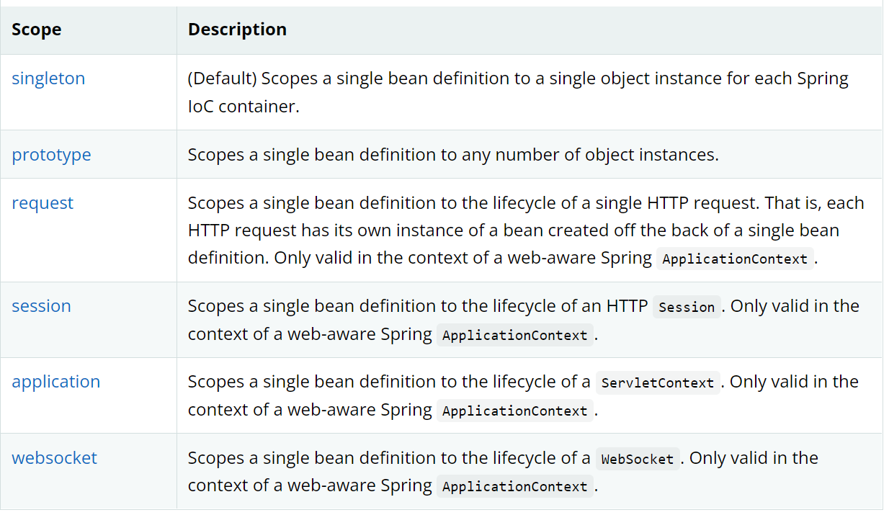
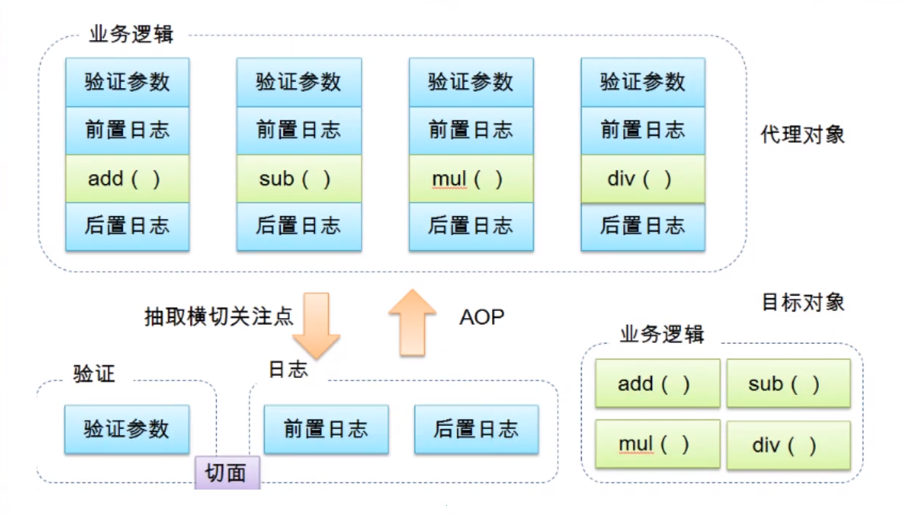
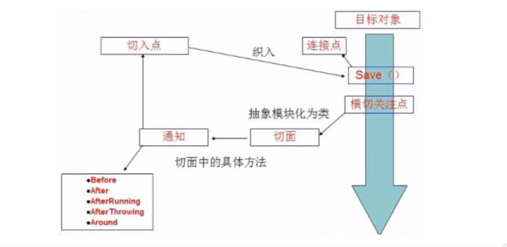
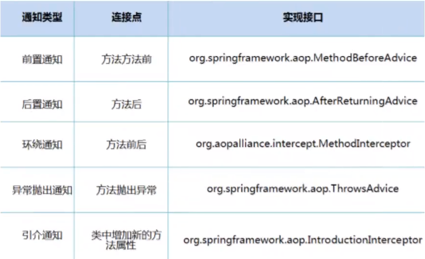

# 1、Spring

## 1.1、简介：

- 2002年，首次推出了spring框架的雏形：interface21框架

- spring框架基于interface21，经过重新开发，并不断丰富其内涵，与2004年发布了1.0正式版
- spring framework的创始人Rod Johnson，是悉尼大学的音乐学博士
- spring的理念是：使现有的技术更加容易使用，本身是一个大杂烩，融合了现有的技术框架
- SSH：Struct2 + Spring + Hibernate
- SSM：SpringMvc + Spring + Mybatis

其官网为：https:/lspring.io/projects/spring-framework#overview

下载地址：http://repo.spring.io/release/orglspringframework/spring

GitHub开源地址：https:/lgithub.comlspring-projects/spring-framework

在maven项目中的配置代码：

~~~xml
<dependencies>
        <!-- https://mvnrepository.com/artifact/org.springframework/spring-webmvc -->
        <dependency>
            <groupId>org.springframework</groupId>
            <artifactId>spring-webmvc</artifactId>
            <version>5.3.22</version>
        </dependency>
    </dependencies>
~~~

上述配置可以一键设置，当然也可以选择jdbc的设置。

~~~xml
<dependencies>
        <!-- https://mvnrepository.com/artifact/org.springframework/spring-webmvc -->
        <dependency>
            <groupId>org.springframework</groupId>
            <artifactId>spring-jdbc</artifactId>
            <version>5.3.22</version>
        </dependency>
    </dependencies>
~~~

## 1.2、优点：

- Spring是一个开源的免费框架（容器）
- Srping是一个轻量的、非入寝式的框架（不会对别的项目产生影响）
- 控制反转（IOC），面向切面编程（AOP）
- 支持事务的处理，对框架整合的支持

一句话：Spring就是一个轻量的控制反转（IOC）和面向切面编程（AOP）的框架

# 2、IOC理论推导

1. UserDao 接口
2. UserDaoImpl 接口实现类
3. UserService 业务接口
4. UserServiceimpl 业务接口实现类

在之前的开发中，用户的需求可能会影响我们原来的代码，我们需要根据用户的需求去修改源代码。如果程序代码量十分庞大，那么修改一次的成本、代价是十分昂贵的。

然而，当我们转而去使用set接口时，会发现产生了革命性的变化！

~~~java
//利用set方法动态实现值的注入
public void setUserDao(Userdao userdao){
    this.userdao = userdao;
}
~~~

- 之前，程序是主动创建对象，控制权在程序员手上
- 使用了set方法进行注入，程序不再具有主动性，而是变成了被动接收对象

这种思想，从本质上解决了问题，使得我们程序员不用再去管理对象的创建！这也使得系统的耦合度大大降低，可以更加专注在业务的实现上。这就是IOC的原型。

## IOC本质：

控制反转IoC（Inversion of Control），是一种设计思想，DI（依赖注入）是实现IoC的一种方式。在没有IoC的程序中，我们使用面向对象编程，对象的创建与对象间的依赖完全硬解码在程序中，对象的创建由程序自己控制，控制反转后将对象的创建转移给第三方。个人所谓的控制反转就是：获得依赖对象的方式发生了反转。

从用xml的方式配置bean的时候，bean的定义信息是与“实现”相分离的。而采用注解的方式可以把两者结合在一起。bean的定义信息直接以注解的形式定义在实现类中，从而达到了零配置的目的。

**控制反转是一种通过描述（XML或注解）并通过第三方去生产或获取特定对象的方式。在Spring中实现控制反转的是loC容器，其实现方法是依赖注入(Dependency Injection,Dl)。**

# 3、IOC创建对象方式

IOC对象被调用后，会返回一个动态对象（我们所设计的），这个对象就是默认调用了其类中的无参构造方法。

## beans.xml基本格式：

~~~xml
<?xml version="1.0" encoding="UTF-8"?>
<beans xmlns="http://www.springframework.org/schema/beans"
       xmlns:xsi="http://www.w3.org/2001/XMLSchema-instance"
       xsi:schemaLocation="http://www.springframework.org/schema/beans
        https://www.springframework.org/schema/beans/spring-beans.xsd">

    <!--使用spring来创建对象，在spring中这些都被称为bean-->
    <bean>
    </bean>

</beans>
~~~

我们只需按要求添加bean即可，模板来自于官网。

## 有参构造：

1. 通过下标赋值：

	~~~xml
	<bean id="exampleBean" class="examples.ExampleBean">
	    <constructor-arg index="0" value="7500"/>
	    <constructor-arg index="1" value="test"/>
	</bean>
	~~~

	

2. 通过类型创建：

	~~~xml
	<bean id="emxapleBean" class="example.ExampleBean">
	    <constructor-arg type="int" value="759"/>
	    <constructor-arg typr="java.lang.String" value="Hello"/>
	</bean>
	~~~

	不推荐这种创建方式，对于有些拥有多个相同类型的形参的构造方法不适用

3. 参数名：

	~~~xml
	<bean id="exampleBean" class="examples.ExampleBean">
	    <constructor-arg name="age" value="22"/>
	</bean>
	~~~

在配置文件（.xml）被加载的时候，文件中管理的所有bean都会被初始化（实例化），多个相同类的对象，在内存中只有一个（类似于单例模式）

# 4、Spring配置

## 4.1、别名：

```xml
<!--如果添加了别名，我们也可以通过别名来获取对象-->
<alias name="user" alias="userNew"/>
```

## 4.2、Bean的配置：

~~~xml
<!--id：bean的唯一标识符，也就是我们学的对象名
class：bean所对应的全限定名，即：包名+类名
name：也是别名，可以同时取多个别名（全部包括在双引号中，可以使用逗号、空格、分号等分隔）
-->
<bean id="userT" class="examples.ExampleBean" name="user2 u2,u3;u4">
    <property name="age" value="22"/>
</bean>
~~~

## 4.3、import导入：

如果这个spring项目有多个人在开发，我们会使用不同的beans.xml文件来配置每个人不同的需求，最后完成的时候，我们就会用import把这些文件全部导入到一个总的文件中。这个总的文件我们一般命名为：*applicationContext.xml*

~~~xml
<import resource="beans.xml"/>
<import resource="beans1.xml"/>
~~~

# 5、依赖注入（DI）

## 5.1、构造器注入：

该种方式已经在第三章（IOC的几种创建对象的方式）中详述。

## 5.2、Set方式注入（重要）：

- 依赖注入（Set注入）：
	- 依赖：bean对象的创建依赖于容器
	- 注入：bean对象中的所有属性，由容器来注入

【环境搭建】

1. 复杂类型
2. 真实测试环境

实体类：

~~~java
package com.learn;
/**
 * @author ritia
 * {@code @create} 2022-08-11
 **/

public class Address {
    private String address;

    public String getAddress() {
        return address;
    }

    public void setAddress(String address) {
        this.address = address;
    }

    @Override
    public String toString() {
        return "Address{" +
                "address='" + address + '\'' +
                '}';
    }
}
~~~

~~~java
package com.learn;

import java.util.*;

/**
 * @author ritia
 * &#064;create  2022-08-11
 **/

public class Student {
    private String name;
    private Address address;
    private String[] books;
    private List<String> hobbies;
    private Map<String, String> card;
    private Set<String> games;
    private String wife;
    private Properties info;

    public String getName() {
        return name;
    }

    public void setName(String name) {
        this.name = name;
    }

    public Address getAddress() {
        return address;
    }

    public void setAddress(Address address) {
        this.address = address;
    }

    public String[] getBooks() {
        return books;
    }

    public void setBooks(String[] books) {
        this.books = books;
    }

    public List<String> getHobbies() {
        return hobbies;
    }

    public void setHobbies(List<String> hobbies) {
        this.hobbies = hobbies;
    }

    public Map<String, String> getCard() {
        return card;
    }

    public void setCard(Map<String, String> card) {
        this.card = card;
    }

    public Set<String> getGames() {
        return games;
    }

    public void setGames(Set<String> games) {
        this.games = games;
    }

    public String getWife() {
        return wife;
    }

    public void setWife(String wife) {
        this.wife = wife;
    }

    public Properties getInfo() {
        return info;
    }

    public void setInfo(Properties info) {
        this.info = info;
    }

    @Override
    public String toString() {
        return "Student{" +
                "name='" + name + '\'' +
                ", address=" + address +
                ", books=" + Arrays.toString(books) +
                ", hobbies=" + hobbies +
                ", card=" + card +
                ", games=" + games +
                ", wife='" + wife + '\'' +
                ", info=" + info +
                '}';
    }
}
~~~

测试类

~~~java
package com.learn;

import org.springframework.context.ApplicationContext;
import org.springframework.context.support.ClassPathXmlApplicationContext;

/**
 * @author ritia
 * &#064;create  2022-08-11
 **/

public class MyTest {
    public static void main(String[] args) {
        ApplicationContext context = new ClassPathXmlApplicationContext("beans.xml");
        Object hello = context.getBean("student");
        System.out.println(hello);
    }
}
~~~

Spring注入（通过XML）

~~~xml
<?xml version="1.0" encoding="UTF-8"?>
<beans xmlns="http://www.springframework.org/schema/beans"
       xmlns:xsi="http://www.w3.org/2001/XMLSchema-instance"
       xsi:schemaLocation="http://www.springframework.org/schema/beans
        https://www.springframework.org/schema/beans/spring-beans.xsd">

    <!--使用spring来创建对象，在spring中这些都被称为bean-->
    <bean id="address" class="com.learn.Address">
        <property name="address" value="泉州"/>
    </bean>

    <bean id="student" class="com.learn.Student">
        <!--第一种，普通值注入-->
        <property name="name" value="zh"/>
        <!--第二种，bean注入-->
        <property name="address" ref="address"/>
        <!--第三种，数组注入-->
        <property name="books">
            <array>
                <value>红楼梦</value>
                <value>西游记</value>
                <value>水浒传</value>
                <value>三国演义</value>
            </array>
        </property>
        <!--List注入-->
        <property name="hobbies">
            <list>
                <value>听歌</value>
                <value>敲代码</value>
                <value>看电视</value>
            </list>
        </property>
        <!--Map注入-->
        <property name="card">
            <map>
                <entry key="身份证" value="1234567890"/>
                <entry key="银行卡" value="1234345234"/>
                <entry key="" value=""/>
            </map>
        </property>
        <!--Set注入-->
        <property name="games">
            <set>
                <value>王者</value>
                <value>LoL</value>
                <value>CoC</value>
            </set>
        </property>
        <!--Properties注入-->
        <property name="info">
            <props>
                <prop key="性别">男</prop>
                <prop key="学号">29</prop>
                <prop key="年龄">22</prop>
            </props>
        </property>
        <!--空指针注入-->
        <property name="wife">
            <null/>
        </property>
    </bean>

</beans>
~~~

## 5.3、扩展方式注入：

### 5.3.1 通过P命名空间方式注入：

所谓的P命名空间的方式注入也即代替了properties的复杂形式。

范例：

~~~xml
//需要在开头导入此依赖
xmlns:p="http://www.springframework.org/schema/p"

<bean name="john-classic" class="com.example.Person">
    <property name="name" value="John Doe"/>
    <property name="spouse" ref="jane"/>
</bean>

<bean name="john-modern"
      class="com.example.Person"
      p:name="John Doe"
      p:spouse-ref="jane"/>

<bean name="jane" class="com.example.Person">
    <property name="name" value="Jane Doe"/>
</bean>
~~~

### 5.3.2 通过C命名空间方式注入：

所谓的C命名空间方式也就是调用构造器，主要是调用有参构造器，当然前提也就是在所使用的对象的类中要有对应的构造器。

范例：

~~~xml
<!--开头需要导入此依赖-->
xmlns:c="http://www.springframework.org/schema/c"

<bean id="beanTwo" class="x.y.ThingTwo"/>
<bean id="beanThree" class="x.y.ThingThree"/>

<!-- traditional declaration with optional argument names -->
<bean id="beanOne" class="x.y.ThingOne">
    <constructor-arg name="thingTwo" ref="beanTwo"/>
    <constructor-arg name="thingThree" ref="beanThree"/>
    <constructor-arg name="email" value="something@somewhere.com"/>
</bean>

<!-- c-namespace declaration with argument names -->
<bean id="beanOne" class="x.y.ThingOne" c:thingTwo-ref="beanTwo"
      c:thingThree-ref="beanThree" c:email="something@somewhere.com"/>

<!--也可以采用索引的方式-->
<bean id="beanOne" class="x.y.ThingOne" c:_0-ref="beanTwo" c:_1-ref="beanThree"
    c:_2="something@somewhere.com"/>
~~~

## 5.4、Bean的作用域：



### 5.4.1 单例模式（Spring默认机制）：

~~~xml
1 <bean id="user2" class="com.nty.pojo.user" c:age="18" c:name="狂神" scope="sing1eton" />
~~~

只有一个单例 bean 的共享实例被管理，并且所有对具有一个或多个与该 bean 定义匹配的 ID 的 bean 的请求都会导致 Spring 容器返回一个特定的 bean 实例（多个对象共享内存中的同一个实例）

### 5.4.2 原型模式：

每次从容器中get的时候，都会产生一个新对象!

~~~xml
1<bean id="accountservice" class="com.something.Defau1tAccountservice" scope="prototype" />
~~~

### 5.4.3 其余的模式：

其余的request、session、 application、这些个只能在web开发中使用到!

# 6、Bean的自动装配

- 自动装配是Spring满足Bean依赖的一种方式
- Spring会自动在上下文中寻找，并自动给Bean装配属性

在Spring中有三种装配方式：

1. 在xml中显示的配置
2. 在Java中显示配置
3. 隐式的自动装配bean【重要！】

## 6.1 原始代码实现：

一个人有两只宠物，一只猫，一只狗，两只宠物都会叫。

## 6.2 byName自动装配：

~~~xml
<bean id="cat" class="com.learn.Cat"/>
<bean id="dog" class="com.learn.Dog"/>

<bean id="person" class="com.learn.People" autowire="byName"
      p:name="ZH"/>
~~~

## 6.3 byType自动装配：

~~~xml
<bean id="cat" class="com.learn.Cat"/>
<bean id="dog" class="com.learn.Dog"/>

<bean id="person" class="com.learn.People" autowire="byType"
      p:name="ZH"/>
~~~

### 两种装配方式的比较：

- 使用byName自动装配，Spring会获取set方法中的变量名，然后在xml配置的上下文中寻找是否有与变量匹配的beanID，Spring能够自动识别大小写，但不支持有前后缀及其他的更改

- 使用byType自动装配，Spring会在xml中寻找与自动注入的属性相匹配的bean的类型。

	但是也要注意一个类型只能对应一个bean，要保证需要获取的类型唯一。好处是此时可以不写需要获取的bean的ID

## 6.4 使用注解自动装配：

要使用Spring的注解自动装配，那么需要先进行以下工作：

- 导入约束，导入context约束。
- **配置注解的支持**【缺一不可】

~~~xml
<?xml version="1.0" encoding="UTF-8"?>
<beans xmlns="http://www.springframework.org/schema/beans"
       xmlns:xsi="http://www.w3.org/2001/XMLSchema-instance"      
<!--下面的context链接与xmlns中bean的链接相似，只要将bean更改为context即可-->       
xmlns:context="http://www.springframework.org/schema/context"
       xmlns:p="http://www.springframework.org/schema/p"
       xsi:schemaLocation="http://www.springframework.org/schema/beans
            https://www.springframework.org/schema/beans/spring-beans.xsd
	<!--同上，链接相似，将bean更改为context即可-->
            http://www.springframework.org/schema/context
            https://www.springframework.org/schema/context/spring-context.xsd">
       <!--开启注解的支持-->
       <context:annotation-config/>
~~~

### 6.4.1 @Autowired：

只需在要注入的类中，在其要注入的属性的声明上方或者其set方法中添加此注释即可。因为Spring使用此自动装配是通过反射实现的，即使该类中没有set方法/属性的声明为private，依然可以完成注入。但要注意@Autowired的自动装配与byName差不多，依靠ID匹配，应使得bean的ID唯一。

该注解可能带参数@Autowired(required = false)，这样的意思是允许该属性的注入为空。

允许在@Autowired的下方连带使用@Qualifier("beanID")，此注释用来指示在自动装配时注入指定的bean。

~~~java
public class People {
    private String name;
    @Autowired
    private Dog dog;
    @Autowired
    private Cat cat;
}
~~~

### 6.4.2 @Resource：

该注解声明在Java中而非Spring中，此注解更加强大（但是也不智能），与@Autowired相反的机制，其使用的是类型匹配，也可以在后面添加括号来指定要注入的bean。

~~~java
public class SimpleMovieLister {

    private MovieFinder movieFinder;

    @Resource(name="myMovieFinder") 
    public void setMovieFinder(MovieFinder movieFinder) {
        this.movieFinder = movieFinder;
    }
}
~~~

# 7、使用注解开发

在Spring 4之后，若是想使用注解开发，那么就需要保证AOP依赖包已经导入

同样需要保证context约束已导入，已开启context支持。

## 7.1 源代码

applicationContext.xml

~~~xml
<?xml version="1.0" encoding="UTF-8"?>
<beans xmlns="http://www.springframework.org/schema/beans"
       xmlns:xsi="http://www.w3.org/2001/XMLSchema-instance"
       xmlns:context="http://www.springframework.org/schema/context"
       xsi:schemaLocation="http://www.springframework.org/schema/beans
            https://www.springframework.org/schema/beans/spring-beans.xsd
            http://www.springframework.org/schema/context
            https://www.springframework.org/schema/context/spring-context.xsd">
    <!--扫描指定包，交由Spring管理-->
       <context:component-scan base-package="com.learn"/>
     <!--开启注解的支持-->
       <context:annotation-config/>

</beans>
~~~

People.java

~~~java
@Component(value = "person")
public class People {
    @Value("Jerry")
    private String name;
    @Autowired
    private Dog dog;
    @Autowired
    private Cat cat;
    //****getter和setter
}
~~~

测试类：

~~~java
public static void main(String[] args) {
    ApplicationContext context = new ClassPathXmlApplicationContext(
        "beans.xml");
    // People hello = context.getBean("person", People.class);
    People hello = (People) context.getBean("person");
    hello.getCat().crying();
    hello.getDog().crying();
    System.out.println(hello.getName());
}
~~~

使用这种注解，就无需在xml中声明bean并调用，这种方式更加简便，使用@Componet注解就相当于创建了一个bean，注解中的value值就相当于bean的ID，其他方式同beans.xml。

## 7.2 衍生的注解

@Componet有几个衍生的注解，我们在web开发中，会按照mvc三层架构分层

1. @Repository【dao】
2. @Service【service】
3. @Controller【controller】

这些衍生的注解作用与@Componet相同，我们只是在开发的不同层面使用不同的注解，以此使得结构更加清晰。

## 7.3 作用域

要想使得此类为单例模式或者原型模式还是其他模式，可以追加使用注解@Scope来标注，与在xml文件中声明bean中使用scope的意思相同。

~~~java
@Component(value = "person")
@Scope("singleton")
public class People {
    @Value("Jerry")
    private String name;
    @Autowired
    private Dog dog;
    @Autowired
    private Cat cat;
    //****getter和setter
}
~~~

## 7.4 小结

xml与注解：

- xml更加万能，适用于各种场合，集中管理，维护简单。（尤其是代码量大、注入多时）
- 注解：不是自己的类无法使用，维护相对复杂。

xml与注解的最佳实践：

- xml用来管理bean
- 注解只负责完成属性的注入
- 我们在使用的过程中，只需要注意一个问题：必须让注解生效，就需要开启注解的支持！

# 8、使用Java的方式配置Spring

JavaConfig 是Spring的一个子项目，在Spring 4之后，它成为了一个核心功能!

有了此项目，我们完全可以脱离xml的配置，只使用Java代码。

我们需要一个Java配置类（用来代替xml）

实体类：

~~~java
//这里这个注解的意思，就是说明这个类被Spring接管了，注册到了Spring容器中
@Component
public class User {
    public String name;

    public String getName() {
        return name;
    }

    @Value("其打样") //属性注入值
    public void setName(String name) {
        this.name = name;
    }

    @Override
    public String toString() {
        return "User{" +
            "name='" + name + '\'' +
            '}';
}
~~~

配置类：

~~~java
@Configuration
//这个也会被Spring容器托管，注册到容器中，因为他本来就是一个@Component
//@Configuration 代表这是一个配置类，就和我们之前看的beans.xml是一样的
@ComponentScan("com.nty")
//@Import 用于导入第三方包，可一个，也可以导入多个
@Import(UserConfig2.class)
public class UserConfig {
    //注册一个bean，就相当于之前写的一个bean标签
    //这个方法的名字就相当于bean标签中的id属性
    //这个方法的返回值就相当于bean标签中的class属性
    @Bean
    public User getUser() {
        //就是返回要注入到bean中的对象！
        return new User();
    }
}
~~~

测试类：

~~~java
public class MyTest {
    public static void main(String[] args) {
        //如果完全使用了配置类方式去做，我们就只能通过AnnotationConfig 上:下文来获取容器，通过配置类的cLass对象加载!
        ApplicationContext context = new AnnotationConfigApplicationContext(UserConfig.class);
        User user =(User) context.getBean("getUser");
        System.out.println(user.getName());
    }
}
~~~

这种纯Java模式的配置，在SpringBoot中随处可见！

# 9、代理模式

为什么要学习代理模式？因为就是SpringAOP的底层！【SpringAOP 和 SpringMVC】

代理模式

- 静态代理
- 动态代理

## 9.1 静态代理

角色分析：

- 抽象角色：抽象的事物、带有抽象的任务（一般体现为抽象类或者接口）
- 真实角色：被代理的角色，是抽象角色的实现（体现为实体类）
- 代理角色：代理人，替代被代理的角色执行操作，一般额外带有自己的附属属性
- 客户：访问代理对象的人

抽象角色：

~~~java
public interface Rent {
    //出租房屋
    public void rent();
}
~~~

真实角色：

~~~java
public class Host implements Rent{

    @Override
    public void rent() {
        System.out.println("房东要出租房子！");
    }
}
~~~

代理角色：

~~~java
public class Proxy implements Rent{
    private Host host;

    public Proxy() {
    }

    public Proxy(Host host) {
        this.host = host;
    }

    @Override
    public void rent() {
        host.rent();
        seeHouse();
        signAgreement();
        free();
    }

    //看房
    public void seeHouse(){
        System.out.println("中介带你看房！");
    }

    //签合同
    public void signAgreement(){
        System.out.println("签租赁合同");
    }
    //收中介费
    public void free(){
        System.out.println("收中介费");
    }
}
~~~

客户：

~~~java
public class Client {
    public static void main(String[] args) {

        //房东要出租房子
        Host host = new Host();
        /*host.rent();*/

        //代理，中介帮房东出租房子，但中介会有一些附属操作
        Proxy proxy = new Proxy(host);
        //你不用面对房东，找中介租房即可！
        proxy.rent();
    }
}
~~~

代理模式的好处：

1. 可以使真实角色的操作更加纯粹!不用去关注一些公共的业会公共也就就交给代理角色!

	想要添加额外的功能、操作不需要改动真实角色的代码

2. 实现了业务的分工!

3. 公共业务发生扩展的时候，方便集中管理!

缺点：一个真实角色就会产生一个或多个代理角色，有多个真实对象时，代码量会翻倍，占用的内存更多，开发效率降低

## 9.2 动态代理

动态代理和静态代理角色一样，动态代理的代理类是动态生成的，不是我们直接写好的!

动态代理分为两大类:基于接口的动态代理，基于类的动态代理

- 基于接口---JDK动态代理 ----【我们在这里使用】
- 基于类:cglib
- java字节码实现: javassist

这里需要了解两个类：Proxy（代理）类和InvocationHandler（调用处理程序）接口

动态代理的好处：

- 可以使真实角色的操作更加纯粹!不用去关注一些公共的业务
- 公共也就交给代理角色!实现了业务的分工!
- 公共业务发生扩展的时候，方便集中管理!
- 一个动态代理类代理的是一个接口，一般就是对应的一类业务。
- 一个动态代理类可以代理多个类，只要是实现了同一个接口即可!

动态代理的代理对象在编译器执行操作时才会被确定，其是通过反射确定的，实际上并不存在。

代理类模板：

~~~java
import java.lang.reflect.InvocationHandler;
import java.lang.reflect.Method;
import java.lang.reflect.Proxy;

/**
 * @author ritia
 * &#064;create  2022-08-12
 **/

public class ProxyInvocationHandler implements InvocationHandler {

    private Object target;

    public void setTarget(Object target) {
        this.target = target;
    }

    public Object getProxy() {
        return Proxy.newProxyInstance(target.getClass().getClassLoader(),
                target.getClass().getInterfaces(),this);
    }
    @Override
    public Object invoke(Object proxy, Method method, Object[] args) throws Throwable {
        return method.invoke(target,args);
    }
}
~~~

客户端：

~~~java
public static void main(String[] args) {
    People person = new People();
    ProxyInvocationHandler pih = new ProxyInvocationHandler();
    pih.setTarget(person);
    //注意，我们的动态代理所代理的是接口，也就是我们的实现类所实现的接口
    Human proxy = (Human) pih.getProxy();//使用强转
    proxy.feed();
}
~~~

# 10、AOP

## 10.1 什么是AOP

AOP (Aspect Oriented Programming)意为: 面向切面编程，通过预编译方式和运行期动态代理实现程序功能的统一维护的一种技术。AOP是OOP的延续，是软件开发中的一个热点，也是Spring框架中的一个重要内容，是函数式编程的一种衍生范型。利用AOP可以对业务逻辑的各个部分进行隔离，从而使得业务逻辑各部分之间的耦合度降低，提高程序的可重用性，同时提高了开发的效率。





## 10.2 在Spring中的AOP

提供声明式事务;允许用户自定义切面。

- 横切关注点:跨越应用程序多个模块的方法或功能。即是，与我们业务逻辑无关的，但是我们需要关注的部分，就是横切关注点。如日志，安全，缓存，事务等等....
- 切面(ASPECT)︰横切关注点被模块化的特殊对象。即，它是一个类。
- 通知(Advice) :切面必须要完成的工作。即，它是类中的一个方法。
- 目标(Target)︰被通知对象。
- 代理（Proxy)∶向目标对象应用通知之后创建的对象。
- 切入点（PointCut):切面通知执行的“地点"的定义。
- 连接点(JointPoint):与切入点匹配的执行点。

SpringAOP中，通过Advice定义横切逻辑（横切关注点），Spring中支持5种类型的Advice：



AOP就是一种动态代理模式，可以通过Spring来实现，在不改变原有代码的基础上增加新功能

# 10.3 在Spring中实现AOP[重要]

使用AOP时，需要在prom.xml中导入相应的依赖包：

~~~xml
//这个依赖在笔者构建项目时发生异常（在路径中找不到类）
//在查阅谷歌的相应文章后，在Eclipse的异常报告中找到了解决办法
<!-- https://mvnrepository.com/artifact/org.aspectj/aspectjweaver -->
<dependency>
    <groupId>org.aspectj</groupId>
    <artifactId>aspectjweaver</artifactId>
    <version>1.9.9.1</version>
</dependency>

//在发生我描述的错误后，需要将上述依赖包更改为下列依赖包
//如果没有发生此错误，仍建议使用上述依赖包
<!-- https://repo.maven.apache.org/maven2/aspectj/aspectjweaver/1.5.4 -->
<dependency>
    <groupId>aspectj</groupId>
    <artifactId>aspectjweaver</artifactId>
    <version>1.5.4</version>
</dependency>
~~~

注册bean（在applicationContext.xml中）：

~~~xml
<?xml version="1.0" encoding="UTF-8"?>
<beans xmlns:xsi="http://www.w3.org/2001/XMLSchema-instance"
       //需要导入约束
       xmlns:aop="http://www.springframework.org/schema/aop"
       xmlns="http://www.springframework.org/schema/beans"
       xsi:schemaLocation="http://www.springframework.org/schema/beans
        https://www.springframework.org/schema/beans/spring-beans.xsd
		//链接也应更新
        http://www.springframework.org/schema/aop
        https://www.springframework.org/schema/aop/spring-aop.xsd">

    <!--注册Bean-->
    <bean id="serviceImpl" class="zh.learn.ServiceImpl"/>
    <bean id="log" class="zh.learn.Log"/>
    <bean id="after_log" class="zh.learn.AfterLog"/>
</beans>
~~~

### 10.3.1 使用Spring的接口

这是Spring的AOP原生方式，主要是Spring API接口的实现

配置applicationContext.xml：

~~~xml
<!--设置在bean注册之后-->
<aop:config>
    <!--切入点 expression :表达式 execution:要执行的位置-->
    <aop:pointcut id="pointcut" expression="execution(* zh.learn.ServiceImpl.*(..))"/>
    <!--执行环绕增加-->
    <aop:advisor advice-ref="log" pointcut-ref="pointcut"/>
    <aop:advisor advice-ref="after_log" pointcut-ref="pointcut"/>
</aop:config>
~~~

前置日志类：

~~~java
public class Log implements MethodBeforeAdvice {
    @Override
    public void before(Method method, Object[] args, Object target) throws Throwable {
        System.out.println(target.getClass().getName() + "的"+ method.getName() +
                "被执行");
    }
}
~~~

后置日志类：

~~~java
public class AfterLog implements AfterReturningAdvice {
    //该方法可以获取返回值，即该方法的returnValue变量参数
    @Override
    public void afterReturning(Object returnValue, Method method, Object[] args, Object target) throws Throwable {
        System.out.println("执行了"+method.getName()+"方法，返回值为"+returnValue);
    }
}
~~~

测试类：

~~~java
@Test
public void test1() {
    ApplicationContext context = new ClassPathXmlApplicationContext("applicationContext.xml");
    //应是为实现类所实现的接口对象
    Service service = (Service) context.getBean("serviceImpl");
    service.add();
}
~~~

### 10.3.2  自定义类实现AOP (XML)

这种方式使用的是定义切面的方法

日志类：

~~~java
//在一个类中可以直接声明所有需要的方法，而不需要一个需要一个类的原生模式
public class newLog {
    public void before() {
        System.out.println("=====方法执行前=====");
    }
    public void after() {
        System.out.println("=====方法执行后=====");
    }
}
~~~

applicationContext.xml：

~~~xml
<bean id="new_log" class="zh.learn.newLog"/>
<bean id="service" class="zh.learn.ServiceImpl"/>
<aop:config>
    <!-- 自定义切面，ref：要引用的类 -->
    <aop:aspect ref="new_log">
        <!--设置横切关注点-->
        <aop:pointcut id="pointcut" expression="execution(* zh.learn.ServiceImpl.*(..))"/>
        <!--在关注点之前使用-->
        <aop:before method="before" pointcut-ref="pointcut"/>
        <!--在关注点之后使用-->
        <aop:after method="after" pointcut-ref="pointcut"/>
        <!--可以使用前面提到的5个advice来插入-->
    </aop:aspect>
</aop:config>
~~~

测试类同原生。

### 10.3.3 使用注解实现

新增功能类：

~~~java
@Aspect
public class newLog {
    //里面的参数为切断点，下同
    @Before("execution(* zh.learn.Service.*(..))")
    public void before() {
        System.out.println("=====方法执行前=====");
    }
    @After("execution(* zh.learn.Service.*(..))")
    public void after() {
        System.out.println("=====方法执行后=====");
    }
    @Around("execution(* zh.learn.Service.*(..))")
    public void around(ProceedingJoinPoint jp) throws Throwable {
        System.out.println("====环绕前====");
        System.out.println(jp.getSignature());
        System.out.println(jp.proceed());
        System.out.println("====环绕后====");
    }
}
~~~

applicationContext.xml：

```xml
<!--设置目标bean，此bean即为切断点-->
<bean id="service" class="zh.learn.ServiceImpl"/>
<!--开启自动代理模式（AOP），开启注解支持 jdk(默认proxy-target-class="false")  cglib(proxy-target-class="true")-->
<aop:aspectj-autoproxy/>
```

测试类同上。

# 11、整合Mybatis

# 12、声明式事务

