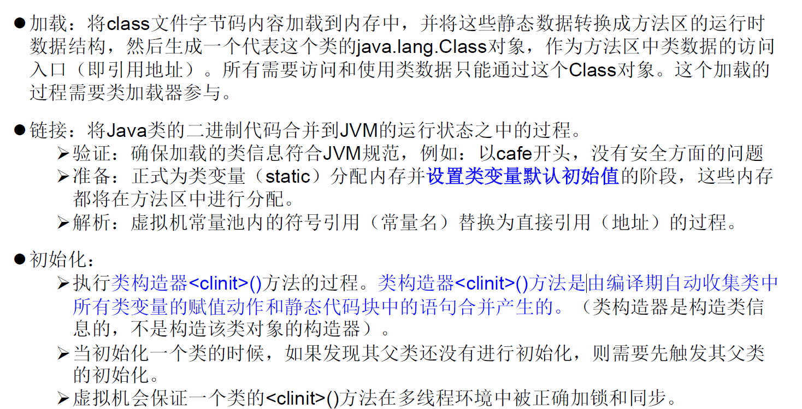

# 反射（Reflection):

Reflection （反射）是 被视为 动态语言 的关键，反射机制允许程序在执行期借助于 Reflection API 取得任何类的内部信息，并能直接操作任意对象的内部属性及方法。加载完类之后 在堆内存的方法区中就产生了一个 Class 类型的对象。一个类只有一个 Class 对象，这个对象就包含了完整的类的结构信息。 我们可以通过这个对象看到类的结构。这个对象就像一面镜子透过这个镜子看到类的结构，所以我们形象的称之为：反射。

正常的加载方式是：先引入“包类”的名称，然后再通过new实例化，最后取得实例化对象。

反射的加载方式是：先取得实例化的对象，然后调用getClass()方法，最后获得完整的“包类”名称。反射的加载方式几乎与正常加载方式相反，更像是在解包。反射的主要实现类是Class类，该类可以看作是所有类的共有结构类。

## Java反射机制提供的功能：

- 在运行时判断任意一个对象所属的类
- 在运行时构造任意一个类的对象
- 在运行时判断任意一个类所具有的成员变量和方法
- 在运行时获取泛型信息
- 在运行时调用任意一个对象的成员变量和方法
- 在运行时处理注解
- 生成动态代理

### 关于反射的一些小问题：

1. 正常的new操作和反射都能够使用构造器创建对象，那么两者的区别是什么？

	大多情况下，使用的是new操作。多数情况下，我们的实例对象在程序运行时就已经确定了，不会再发生更改也不可更改，这时我们采用的就是new操作。这种方式能够满足我们的正常开发需求。但是，当我们开发的Java后端已经启动运行，正式与前端发生交互时，例如登录与注册操作，我们不知道用户会使用哪种操作，这样的对象在程序运行时仍未确定，此时就需要使用反射来进行构造、更改。

2. private就是为了在封装后不被外部类访问，那么反射能够暴力访问的意义何在？

	通常，我们使用权限符就是为了让外部类无法访问，同时也是不希望外部类能够访问（处于某些目的，我们更希望外部调用我们提供的方法）。但是，反射的存在也是不至于让private彻底封死，不能访问。反射相当于留了个后门，必要时能够访问。

## 反射相关的主要API：

- java.lang.Class：代表一个类
- java.lang.reflect.Method：代表类的方法
- java.lang.reflect.Field：代表类的成员变量
- java.lang.reflect.Constructor：代表类的构造器

### Class类：

在类的加载过程中：程序经过javac.exe编译后会生成一个或多个字节码文件（.class）。接着我们使用java.exe命令对某个字节码文件进行解释运行。就相当于将某个字节码文件加载到内存当中，此过程就成为类的加载。加载到内存中的类，我们就成为运行时类，该运行时类，就作为Class类的一个实例。这也体现了Java万物皆对象的思想，这里把类也当作对象（就像与“概念”这一词也需要当作对象被“概念”解释）。一个Class实例就对应着一个运行时类。由于Class对象是运行时类，所以我们在编写代码的时候就无法创建一个该实例（此时还没有运行，不存在运行时类）

#### 类的对象：

1. class：

	外部类、成员（成员内部类、静态内部类）、局部内部类、匿名内部类

2. interface：接口

3. []：数组（只要两个数组的元素类型和维度相同，那么这两个数组的Class对象是一样的）

4. enum：枚举

5. annotation：注解@interface

6. primitive type：基本数据类型

7. void

#### 获取Class对象的四种方式：

1. 调用运行时类的属性：

	`Class clazz = Person.class;`这种方式是最不常用的，基本上一开始就将Class对象写死了，灵活性差，很难体现动态性。

2. 通过运行时类的对象，调用getClass()：

	`Class clazz2 = new Person().getClass();`

3. 调用Class的静态方法，forName(String Classpath)：

	`Class clazz3 = Class.forName("com.atguigu.java.Person");`这种方式最常用，灵活性更高

4. 使用类的加载器：ClassLoader（了解）：

	JVM在加载运行时类时，会将运行时类保存在内存中一段时间（保证多个该类对象只有一个运行时类）

	~~~java
	ClassLoader classloader = test.class.getClassLoader();
	Class clazz4 = classloader.loadClass("com.atguigu.java.Person");
	~~~

#### 创建运行时类对象：

~~~Java
public void test1() {
    try {
        Person jerry = new Person("Jerry", 13);
        Class<Person> clazz = Person.class;

        Person obj = clazz.getConstructor().newInstance();
        System.out.println(obj);
        System.out.println(jerry);
    } catch (InstantiationException e) {
        e.printStackTrace();
    } catch (IllegalAccessException e) {
        e.printStackTrace();
    } catch (InvocationTargetException e) {
        e.printStackTrace();
    } catch (NoSuchMethodException e) {
        e.printStackTrace();
    }
}
~~~

newInstance()方法能够返回调用方类的对象（通常会内部使用调用类的空参构造器，空参的原因是避免因为带参限制了这些不确定类，有些类的构造器参数可能不匹配），要想顺利使用，要求：

1. 运行时类必须提供空参的构造器
2. 空参构造器的访问权限必须足以使得该方法能够访问。通常设置为：public

在javabean中要求提供一个空参构造器，原因：

1. 便于通过反射，创建运行时类的对象（在JDK 9以后可以使用带参，但还是建议使用空参）
2. 便于子类继承此运行时类时，默认调用super()时，保证父类有此构造器

#### 获取运行时类的属性：

~~~java
public void test1() {
    Class<Person> clazz = Person.class;
    //获取运行时类中本类与父类中所有声明的公开属性(public)
    // Field[] fields = clazz.getFields();
    //获取本类中所有已声明的属性（所有权限都可），不包括父类
    Field[] declaredFields = clazz.getDeclaredFields();

    for (Field f : declaredFields) {
        //获取权限修饰符
        int modifiers = f.getModifiers();
        System.out.println(Modifier.toString(modifiers));

        //获取数据类型
        Class<?> type = f.getType();
        System.out.println(type.getName());

        //获取变量名
        String name = f.getName();
        System.out.println(name);
    }
}
~~~

获取运行时类的成员方法、构造器与上述类似（只不过获取构造器的方法返回的是本类的构造器，没有父类）

#### 获取运行时类的带泛型父类的泛型：

~~~java
pulic void test() {
    Class clazz = Person.class;
    //获取运行时类的父类
    // Class parent = clazz.getSuperclass();
    Type genericSuperclass = clazz.getGenericSuperclass();
    ParameterizedType paramType = (ParameterizedType) genericSuperclass;
    //获取泛型类型
    Type[] actualTypeArgument = paramType.getActualTypeArgument();
    System.out.println(((Class) actualTypeArgument).getName());
}
~~~

获取运行时类的实现接口（返回值是Class数组）、包与前面无异（调用相应的方法即可）

#### 调用运行时类指定的属性（private）：

~~~java
public void test() {
    Class clazz = Person.class;
    //创建运行时类对象
    Person p = clazz.getConstructor().newInstance();
    
    //getDeclaredField(String fieldName)获取运行时类中指定变量名的属性
    Field name = p.egtDeclaredField("name");
    
    //保证当前属性是可访问的
    name.setAccessible(true);
    //获取、设定指定对象名的此属性
    name.set(p,"Tom");
    
    System.out.println(name.get(p));
}
~~~

#### 调用运行时类指定的方法（private）：

~~~java
public void test() {
    Class clazz = Person.class;
    //创建运行时类对象
    Person p = clazz.getConstructor().newInstance();
    
    //getDeclaredMethod(String methodName, Class className)获取运行时类中指定方法名的方法
    //第一个参数是要获取的参数名，第二个参数是该方法的形参列表（要求是Class类型）
    Method name = p.getDeclaredMethod("show",String.class);
    //保证当前方法是可访问的
    name.setAccessible(true);
    //使用invoke()方法，即调用该方法。
    //参数一是需要调用方法所在的对象，参数二是该方法需要的参数
    //invoke()方法的返回值即所要调用的方法的返回值
    Object returnValue = name.invoke(p,...);
    System.out.println(returnValue);
}
~~~

#### 调用运行时类指定的构造器：

最常用的方法是clazz.getDeclaredConstructor().newInstance()

另一种方法同属性、方法的调用是一样的（流程一样，原理相同）

### ClassLoader：

类加载器的作用是将类（class）装载进内存中的。JVM规范了以下几种加载器：

1. Bootstap Classloader：

	引导类加载器，使用C++编写，是JVM自带的类加载器，**负责加载Java平台核心库**，该类加载器无法被获取。这是最基本的类加载器。

2. Extension Classloader：

	扩展类加载器，负责将./jre/lib/ext目录下的jar包或-D java.ext.dirs 指定目录下的jar包装入工作库

3. System Classloader：

	系统类加载器，负责 java classpath 或 Dava.class.path 所指的目录下的类与 jar 包装入工作，是最常用的加载器。

4. 自定义类加载器。

每一个类加载器对象都能够调用getParant()方法来获取更底层的类加载器（引导类加载器无法被获取）。

#### 使用ClassLoader读取properties文件：

~~~Java
public void test2() throws IOException {
    ClassLoader loader1 = TCPTest.class.getClassLoader();
    Properties pros = new Properties();
    //类加载器的默认路径在src目录下
    InputStream is = loader1.getResourceAsStream("jdbc.properties");
    pros.load(is);

    //I/O流的方式读取
    // FileInputStream fis = new FileInputStream("src\\jdbc.properties");
    // pros.load(fis);

    String user = pros.getProperty("user");
    String password = pros.getProperty("password");
    System.out.println("user = " + user + ", password = " + password);
}
~~~

## 动态语言：

其是一类在运行时可以改变其结构的语言：例如新的函数、对象、甚至代码可以被引进，已有的函数可以被删除或是其他结构上的变化。通俗点说就是在运行时代码可以根据某些条件改变自身结构。主要动态语言：Object C、C#、JavaScript、PHP、Python、Erlang 。

## 静态语言：

与动态语言相对应的，运行时结构不可变的语言就是静态语言。如 Java、C、C++。Java不是动态语言，但 Java 可以称之为准动态语言。即 Java 有一定的动态性。我们可以利用反射机制、字节码操作获得类似动态语言的特性。Java 的动态性让编程的时候更加灵活。

## 反射的应用：

### 动态代理：

代理模式：角色有代理类和被代理类。当有任务需要被代理类完成时，由代理类提供相应的方法和操作替代被代理类完成，这样的模式就被称为代理模式。通常一种任务有对应的一套代理类，这样的方式被称为静态代理。但是如果有很多不同种类的任务，那么就需要很多套不同的代理模式，这样就造成了极大的浪费，于是动态代理应运而生，利用反射，仅在被代理类需要的时候创建相应的代理类。

#### 静态代理：

~~~java
//以衣服工厂为例，实现一个静态代理
interface ClothesFactory {
    void produceClothes();
}

class proxyFactory implements ClothesFactory {
    ClothesFactory factory;

    public proxyFactory(ClothesFactory factory) {
        this.factory = factory;
    }

    public proxyFactory() {
    }

    public ClothesFactory getFactory() {
        return factory;
    }

    public void setFactory(ClothesFactory factory) {
        this.factory = factory;
    }

    @Override
    public void produceClothes() {
        System.out.println("代理工厂做一些准备工作");
        factory.produceClothes();
        System.out.println("代理工厂生产完成");
    }
}

class NikeFactory implements ClothesFactory {
    @Override
    public void produceClothes() {
        System.out.println("Nike在生产衣服");
    }
}

public class TCPTest {
    public static void main(String[] args) {
        ClothesFactory factory = new NikeFactory();
        ClothesFactory proxy = new proxyFactory(factory);
        proxy.produceClothes();
    }
}
~~~

#### 动态代理：

要想实现动态代理要解决的问题：

1. 如何根据加载到内存中的被代理类，动态地创建一个代理类及其对象
2. 当通过代理类对象调用方法a时，如何动态地去调用被代理类中的同名方法a

~~~java
//提供一个接口，用于表示某个任务
interface ClothesFactory {
    void produceClothes();
}
//动态代理类的创建类
class proxyFactory {
    //此方法返回创建的动态代理类
    public static Object getProxyInstance(Object obj) {
        MyInvocationHandler handler = new MyInvocationHandler(obj);
        //提供三个参数，参数一是类加载器，参数二是运行时类的接口，用于获取该接口中的方法（为了完成任务）
        //参数三是用于执行invoke()的对象
        return Proxy.newProxyInstance(obj.getClass().getClassLoader(),obj.getClass().getInterfaces(),handler);
    }
}
//用于提供给Proxy.newProxyInstance()
class MyInvocationHandler implements InvocationHandler {

    private final Object obj;

    public MyInvocationHandler(Object obj) {
        this.obj = obj;
    }
    //Proxy.newProxyInstance()中会通过反射获取运行时类，再获取运行时类的接口中的方法对象和方法参数
    //然后将这些参数传递给新建的代理类，等待代理类调用相应方法，将参数传入此方法中。
    @Override
    public Object invoke(Object proxy, Method method, Object[] args) throws Throwable {
        return method.invoke(obj,args);
    }
}

class NikeFactory implements ClothesFactory {
    @Override
    public void produceClothes() {
        System.out.println("Nike在生产衣服");
    }
}

public class TCPTest {
    public static void main(String[] args) {
        ClothesFactory factory = new NikeFactory();
        ClothesFactory proxy = (ClothesFactory) proxyFactory.getProxyInstance(factory);
        proxy.produceClothes();
    }
}
~~~

//663