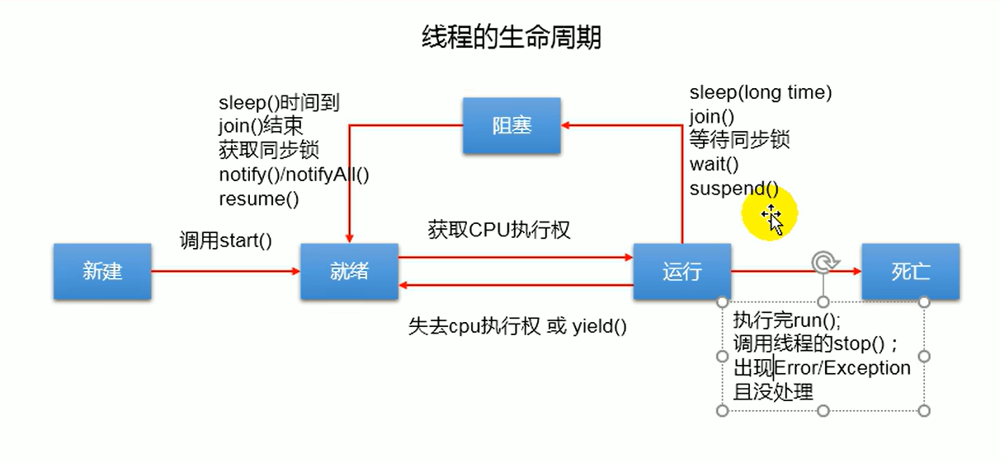

# 多线程[^1]
[^1]: 一共有四种创建方式

## 线程：
即程序的一条执行路径，多线程即一个程序拥有多条执行路径  
在JVM中，每一个线程都有各自的一套虚拟机栈和程序计数器，而所有的进程都共享一套方法区和堆（一个进程中可以有多个线程）

## 类：
类是对象的属性集合，本质上也可以看作是一个对象，对象也是以类为模板而创建的。

### 单核与多核CPU：
单核CPU的多线程实际上为假的多线程，在一个时间单元中该核也最多只能执行一个线程，有多个线程只能等待被处理。但是由于CPU处理速度快，也就造就了同时多线程的假象。  
多核CPU才能执行真正的多线程。一个Java应用程序java.exe至少有三个线程：main()主线程、gc()垃圾回收线程、异常处理线程。
### 并行与并发：
#### 并行：
多个CPU同时执行多个任务（多个人同时做不同事）
#### 并发：
一个CPU（采用时间片）同时执行多个任务

### Java线程的分类：
#### 用户线程：
在Java中最典型的用户线程就是**main()主线程**
#### 守护线程：
在Java中最典型的守护线程就是**gc()垃圾回收线程**
#### 区别：
二者的区别就在于判断JVM何时离开（其他几乎相同）。守护线程是用来服务用户线程的（当JVM里全是守护线程时，JVM将退出），在start()调用前调用`Thread.setDaemon(Ture)`可以把一个用户线程变成守护线程

## Java多线程的创建：
### 定义Thread类[^2]的子类：
[^2]: Thread类（java.lang.Thread），Java的多线程都必须通过该类来实现

该种方式分为四个步骤：
- 新创建一个子类，继承Thread类
- 子类中重写Thread中的run()
- 在执行类中创建子类实例对象
- 实例对象调用start()
#### 注意：
重写的run()的方法体中应为你需要执行的操作（例如遍历100以内的偶数） 
start()执行了两个操作：  
1、创建当前线程  
2、调用run()  
如果没有使用start()而是直接调用run()，那么程序仍然会执行，但是不会新增线程，从始到终就只有main()线程，依照顺序执行  
执行类中main()方法体内，在子类调用start()之前（也包括子类实例调用start()这一行为）都由main()主线程执行，start()后JVM增加一个新的线程来执行run()中的方法体，与main()线程互相独立，谁先执行的先后完全看两条线程各自的性能。  
这也意味着main()中start()后的代码运行结果，可能出现在start()结果前，也可能出现在start()后，或者呈现交叉  
同一个类实例不能调用start()两次（详见start()的源码），要想重复使用，可以新建一个相同类的对象，继续调用start()

#### 简化步骤：
创建子类实例的方式，如果该类只使用一次，可以采用匿名内部类的方式调用start()方法。
```Java
new Thread(){
            @Override
            public void run() {
                for (int i = 0; i < 100; i++) {
                    if (i % 2 == 0)
                        System.out.println(Thread.currentThread().getName()
                                + ":" + i);
                }
            }
        }.start();
```
### Thread类常用方法：
`currentThread()`是Thread类中的*static*方法，作用是返回当前当前正在执行的线程对象。  
`getName()`则是返回Thread类对象的名称。非静态。  
`setName()`作用是设置调用实例对象的线程名称。非静态。  
`yield()`释放调用线程对象的CPU执行权（有可能又会被立即分配到CPU执行器，也有可能不会），非静态。  
`join()`在线程A中调用线程B的join()，此时线程A就会进入阻塞状态，直到线程B执行完毕，线程A才结束阻塞状态（相当于线程B“插队”，挂起线程A，让线程B先执行），非静态  
`stop()`已过时，强制结束当前调用线程。这种方法本质上是不安全的，有可能会造成程序崩溃。非静态。  
`sleep(long millis)`让当前正在执行的线程（调用线程）休眠（暂时停止执行）指定的毫秒数（作为参数传入）。静态方法，同时抛出一个异常（*InterruptedException*），一般需要用*try-catch*来捕获和处理  
`isAlive()`测试调用线程是否存活。如果存活，则传出Ture，否则为False。非静态。

## 其他关于线程的常用方法：
### Object类：
`public final void notify()`
唤醒正在此对象监视器上等待的单个线程。 如果任何线程正在等待此对象，则选择其中一个线程被唤醒。 选择是任意的，由实施决定。 线程通过调用wait方法之一等待对象的监视器。
在当前线程放弃对该对象的锁定之前，唤醒的线程将无法继续。  
`public final void wait() throws InterruptedException`导致当前线程等待它被唤醒，通常是通知或中断 。

## 线程的调度：
### 设置优先级：
`MIN_PRIORITY`：1  
`NORM_PRIORITY`：5  
`MAX_PRIORITY`：10  
`public final int getPriority()`：
返回此线程的优先级。  
`public final void setPriority​(int newPriority)`：更改此线程的优先级。  
优先级越高，该线程抢占到CPU执行权的概率越高。但这不意味着高优先级的线程相对于低优先级的线程就一定能抢占到CPU执行权。只是概率更高而已。

## 多线程使用同变量：
对于多个相同类（父类均为Thread类）线程（实例对象）要操作一个变量，解决方法之一就是将这个变量设置为共同的变量，也就是将此变量定义在子类，定义成static类型

## 多线程实现方法之二[^3]：
[^3]: 另外一种方法详见*定义Thread类的子类*
可分为以下步骤：
- 新建子类，实现Runnable接口
- 在新建子类中重写run()
- 在执行类创建子类实例对象
- 将子类实例对象作为参数，创建Thread类对象
- Thread类对象调用start()

### 注意：
1、Thread类调用start()，该方法同样有两个作用。一是创建新线程。二是调用**Thread**中的run()。如果查看run()的源码，我们就会知道：如果构造时有传入*Runnable*对象，那么run()就会调用Runnable中的run()。传入的子类实现了Runnable接口，也就以多态的方式传入。Thread中的run()调用的是Runnable中的run()，根据多态的原理，执行的是子类重写的run()  
2、每个Thread类实例都只能使用start()一次。要想多线程运行多次，也只能再有参构造一个新的Thread实例对象。  
3、多个线程同时操作一个变量时，变量是规律变化的，最后显示不规律的原因是：System.out.println()也要消耗时间（运行较慢），这也就造成了显示不规律的原因。
~~~Java
private int ticket = 100;
    @Override
    public void run() {
        while (ticket > 0) {
            System.out.println(Thread.currentThread().getName() + ":" + ticket);
            ticket--;
        }
    }
//*******************************************
public class Demo {
    public static void main(String[] args) {
        ThreadTest p = new ThreadTest();
        Thread w1 = new Thread(p);
        Thread w2 = new Thread(p);
        Thread w3 = new Thread(p);

        w1.setName("线程一");
        w2.setName("线程二");
        w3.setName("线程三");

        w1.start();
        w2.start();
        w3.start();
    }
}
~~~
上述代码描述了另一种多线程操作同一变量的方法。  
该方法通过创建子类实现Runnable类，用三个Thread类实例start()而实现。能够实现的原因就在于w1、w2、w3中构造方法的参数都是p，对象相同，三个Thread实例中的run()最终都是指向p，指向p的run()。（三个都是操作堆内存中同一个对象的变量），也就实现了同步。

## 创建多线程的两种方式的比较：
在开发的时候，我们一般优先选择：实现Runnable接口的方式，原因有下：
### 单继承，多实现：
我们需要进行多线程的类，可能本身就有其自身的父类，不方便再继承一个Thread类，但是不妨碍其实现Runnable接口
### 共享：
继承的方式，如果要共享数据等，需要将这些数据设置为static类型，在内存上就不太合适，还要逐个去设置static类型  
实现的方式，因为传入的是同一个对象，这已就实现了共享（共享同一个实例），不用新建内存。不用依次去设置static类型。
### 相同点：
都需要对run()进行重写，都要调用start()
#### 联系：
public class Thread implements Runnable

## 线程的生命周期：
### 线程的五个状态：
具体可以查看源码（Thread.state）Thread的内部类

- 新建：  
刚刚被创建
- 就绪：  
被启动，在时间片外等待执行
- 执行：  
被CPU执行
- 阻塞：  
中断执行，离开时间片
- 死亡：  
线程终止



## 线程的安全问题：
多线程安全问题原因是在cpu执行多线程时，在执行的过程中可能随时切换到其他的线程上执行。  
### 范例分析：
（代码详见本文件“多线程实现方法之二”）
#### 问题：
售票过程中出现了*重票*、*错票*的问题
#### 原因：
当某个线程执行售票的操作过程中，操作尚未完成时，其他线程就也参与进来，对车票进行操作
#### 解决思路：
当一个线程A在操作ticket的时候，其他线程不能参与进来，直到线程A操作完ticket的时候，其他线程才能进来开始操作。即使线程A出现了阻塞，也不能被改变。

## 线程的同步：
### 同步代码块：
（Synchronized）  
1、操作共享数据的代码，即为需要被同步的代码  
2、共享数据：多个线程共同操作的变量  
3、同步监视器：即为“锁”。任何类的一个对象都可以充当“锁”。要求：多个线程必须要共用同一把“锁”。
~~~Java
public class ThreadTest implements Runnable {
    private int ticket = 5000;
    final Object obj = new Object();
    @Override
    public void run() {
        try {
            Thread.sleep(10);
        } catch (InterruptedException e) {
            e.printStackTrace();
        }
        synchronized (obj) {
        while (ticket > 0) {
            System.out.println(Thread.currentThread().getName() + ":" + ticket);
            ticket--;
            }
        }
    }
}
~~~
### 注意：
被Synchronized包括的代码必须要在子类重写的run()中，而作为同步监视器的类对象必须要在run()外类中定义和创建。被锁住的代码块要完全包含要操作的变量，其余的代码块没有必要被包含进去。**不能多也不能少**

#### 错误写法：
~~~Java
public class ThreadTest extends Thread {
    private static int ticket = 100;
    final static Object obj = new Object();

    @Override
    public void run() {
        synchronized (obj) {
            while (ticket > 0) {
                System.out.println(Thread.currentThread().getName() + ":" + ticket);
                ticket--;
            }
        }
    }
}
~~~

#### 正确写法：
~~~Java
public class ThreadTest extends Thread {
    private static int ticket = 100;
    final static Object obj = new Object();

    @Override
    public void run() {
        while (true) {
            try {
                Thread.sleep(500);
            } catch (InterruptedException e) {
                e.printStackTrace();
            }
            synchronized (obj) {
                if (ticket > 0) {
                    System.out.println(Thread.currentThread().getName() + ":" + ticket);
                } else {
                    break;
                }
                ticket--;
            }
        }
    }
}
~~~
两块代码差别：第一个代码将while加入了`Synchronized`中，当第一个执行的线程进入时，按照执行原理，它必然要完成**while**循环才能离开Synchronized，这也就造成了从始至终都只有一个线程在执行。当while循环在外面时，一个线程完成一次循环就要离开，这样才能实现多线程。
#### 错误写法：
~~~Java
public class ThreadTest extends Thread {
    private static int ticket = 100;
    final static Object obj = new Object();

    @Override
    public void run() {
        while (ticket > 0) {
            try {
                Thread.sleep(100);
            } catch (InterruptedException e) {
                e.printStackTrace();
            }
            synchronized (obj) {
                if (ticket > 0)//如果没有这条语句，当ticket只剩下1时，三个线程其实都成功
                    // 进入了while循环，虽说会被synchronized阻塞，但是最后三条语句都会执行
                    // 输出语句，也就是会出现1，0，-1的情形。
                    System.out.println(Thread.currentThread().getName() + ":" + ticket);
                ticket--;
            }
        }
    }
}
~~~
#### 优缺点：
这种方法避免了多个线程同时操作共同变量的问题（变得更加安全），但是也正是如此，也就意味着单个时间片中实际上也是只有一个线程在执行、每次还要根据“锁”来判断时间片中线程数量以及阻塞其他线程，这也降低了程序运行的效率。
### 继承Thread子类的同步：
使用同实现Runnable接口的子类一样，只不过继承类多线程是通过创建n个实例对象实现的，也就意味着“锁”也随着对象的创建而被创建了n次（“锁”不再唯一）、共同操作的变量也不唯一。解决的方法是在“锁”、共同变量的声明前加上`static`。实际上，接口的方法、变量全都是默认有`public static`修饰的。
#### 锁：
“锁”可以分为对象锁和类锁。  
对象锁：以实例作为“锁”，根据锁的要求，共同操作同一变量的线程要共用同一把锁，即实例要相同。所以，我们可以新建一个对象（run()外、类中）作为锁，也可以使用`this`（Runnable接口实现的方式）作为锁。  
类锁：以类作为锁。一般来说，类信息是存在JVM方法区的，并且整个JVM只有一份，方法区又是所有线程共享的，所以类锁是所有线程共享的。

## 同步方法：
当共同操作的变量都在一个方法中，可以考虑将此方法同步（在声明中加入`Synchronized`），编译器默认把**this**作为同步锁。从另一个角度来说，这种方式只适用于实现Runnable接口的方法。
### 代码范例：
~~~Java
public class ThreadTest implements Runnable {
    private int ticket = 100;
    @Override
    public void run() {
        while (show()) {
            try {
                Thread.sleep(500);
            } catch (InterruptedException e) {
                e.printStackTrace();
            }
        }
    }
    public synchronized boolean show() {
        if (ticket > 0) {
            System.out.println(Thread.currentThread().getName() + ":" + ticket);
            ticket--;
            return true;
        }else {
            return false;
        }
    }
}
//*********************************
public class Demo {
    public static void main(String[] args) {
        ThreadTest p = new ThreadTest();

        Thread t1 = new Thread(p);
        Thread t2 = new Thread(p);
        Thread t3 = new Thread(p);

        t1.setName("线程1");
        t2.setName("线程2");
        t3.setName("线程3");

        t1.start();
        t2.start();
        t3.start();
    }
}
~~~
433