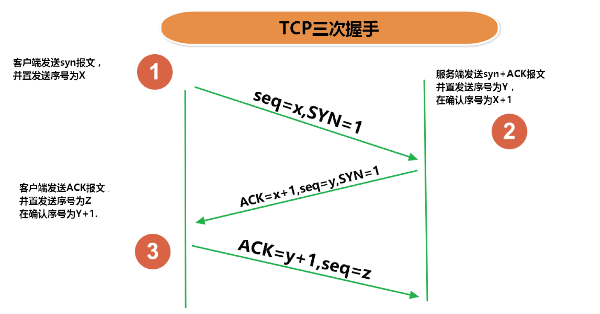
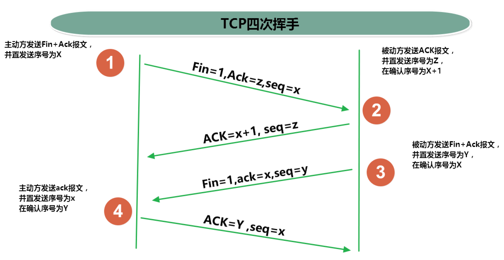

# 网络编程基础：

## 网络编程的目的：

直接或间接地通过网络协议与其它计算机实现数据交换，进行通讯。

### 需要解决的问题：

这些问题主要解决通信与传输问题

1. 如何准确地定位网络上一台或多台主机；定位主机上的特定的应用
2. 找到主机后如何可靠高效地进行数据传输

## 网络编程的要素：

### IP和端口号：

#### InetAddress类：

Java中提供了该类，该类的一个对象就代表着一个IP地址

该类的构造器是私有化的我们无法访问。该类提供了public static InetAddress getLocalHost() 和 public static InetAddress getByName(String host)两个方法用以返回InetAddress类对象。其中getName()方法的参数要求是IP地址或者域名（该方法可以通过DNS获取IP地址）。

##### 常用方法：

- public String getHostAddress()

	返回 IP 地址字符串（以文本表现形式）。

- public String getHostName()

	获取此 IP 地址的主机名。

- public boolean isReachable(int timeout)

	测试是否可以（访问）达到该地址。

#### IP：

唯一的标识 Internet 上的计算机（通信实体），即计算机的网络地址。

本地回环地址hostAddress：127.0.0.1，主机名hostName：localhost

##### 分类方式一：

IPV4 和 IPV6

- IPV4：

	4 个字节组成，4个0-255 。大概42亿，30亿都在北美，亚洲4亿。2011年初已经用尽 。 以点分十进制表示，如192.168.0.1

- IPV6：

	128位（16个节写成 8 个无符号整数，每个整数用四个十六进制位表示，数之间用冒号（：）分开，如：3ffe:3201:1401:1280:c8ff:fe4d:db39:1984

##### 分类方式二：

公网地址：万维网使用和私有地址：局域网使用。192.168.开头的就是私有址址，范围即为192.168.0.0-192.168.255.255，专门为组织机构内部使用

由于IP地址不便于记忆，于是我们采用域名对应IP地址的方式。当我们输入域名时，计算机首先会在系统的**hosts**文件中查询是否已有对应的主机地址，如果没有，计算机就会访问域名解析服务器DNS，DNS解析后将地址传输回本地计算机，计算机再通过得到的IP地址访问网络中的计算机。

#### 端口：

一台计算机上可以同时存在好几个线程，如果只有主机名，我们无法访问计算机上的特定进程，于是我们使用端口来标识计算机上的进程。

端口号被规定为一个 16 位的整数0~65535（16的四次方）。

##### 端口的分类：

- 公认端口：

	0~1023。被预先定义的服务通信占用，如：HTTP 占用端口80，FTP 占用端口21，Telnet 占用端口23

- 注册端口：

	1024~49151。分配给用户进程或应用程序。（如：Tomcat 占用端口8080，MySQL 占用端口3306，Oracle 占用端口1521等） 。

- 动态/私有端口：

	49152~65535

端口号与 IP 地址的组合得出一个网络套接字：Socket

### 网络协议：

传输层有两个非常重要的协议：传输控制协议 TCP(Transmission Control Protocol)和用户数据报协议 UDP(User Datagram Protocol)

#### TCP协议：

- 使用 TCP 协议前，须先建立 TCP 连接，形成传输数据通道
- 传输前，采用“三次握手”方式 ，点对点通信是可靠的
- TCP 协议进行通信的两个应用进程：客户端、服务端。
- 在连接中可进行大数据量的传输
- 传输完毕，需释放已建立的连接，**效率低**

#### UDP协议：

- 将数据、源、目的封装成数据包，不需要建立连接
- 每个数据报的大小限制在 64K 内
- 发送不管对方是否准备好，接收方收到也不确认， 故是不可靠的
- 可以广播发送
- 发送数据结束时无需释放资源 ，开销小，速度快

### Socket类：

利用套接字（Socket）开发网络应用程序早已被广泛的采用，以至于成为事实上的标准。网络上具有唯一标识的 IP 地址和端口号组合在一起才能构成唯一能识别的标识符套接字。通信的两端都要有 Socket，是两台机器间通信的端点。网络通信实际上就是Socket之间的通信。Socket 允许程序把网络连接当成一个流， 数据在两个 Socket 间通过 IO 传输。

#### 基于Socket的TCP编程：

分为服务器端和客户端。

##### 服务器端：

需要创建一个ServerSocket对象，该对象需要一个端口作为该程序的端口（不需要IP地址_InetAddress类的原因是，该类对象默认本机地址作为其IP地址）。然后调用accpet()方法。该方法接受网络上的请求，然后返回一个Socket对象。

##### 客户端：

需要创建一个Socket对象，该对象需要一个InetAddress类（IP地址）和一个端口作为参数，组合起来用于访问远程网络上的服务器端。

------

服务器端accept()返回的Socket与客户端创建的Socket相对应。客户端Scoket的OutputStream和InputStream分别对应服务器端Scoket的InputStream和OutputStream。

~~~Java
//一个简易的应答客户端和服务器端
public void client() {
    Socket socket = null;
    OutputStream otp = null;
    InputStream is = null;
    ByteArrayOutputStream bao = null;
    try {
        InetAddress inetAddress = InetAddress.getByName("127.0.0.1");
        socket = new Socket(inetAddress, 8899);
        bao = new ByteArrayOutputStream();

        //创建输出流
        otp = socket.getOutputStream();
        //输出
        otp.write("你好，这里是客户端".getBytes(StandardCharsets.UTF_8));
        //关闭输出流（让服务器端不再接收）
        socket.shutdownOutput();
        //创建输入流
        is = socket.getInputStream();
        byte[] bt = new byte[20];
        int len;
        while ((len = is.read(bt)) != -1) {
            bao.write(bt,0,len);
        }
        System.out.println("接收到来自" + socket.getInetAddress() + "的数据");
        System.out.println(bao.toString());

    } catch (IOException e) {
        e.printStackTrace();
    } finally {
        if (otp != null) {
            try {
                otp.close();
            } catch (IOException e) {
                e.printStackTrace();
            }
        }
        if (is != null) {
            try {
                is.close();
            } catch (IOException e) {
                e.printStackTrace();
            }
        }
        if (socket != null) {
            try {
                socket.close();
            } catch (IOException e) {
                e.printStackTrace();
            }
        }
        if (bao != null) {
            try {
                bao.close();
            } catch (IOException e) {
                e.printStackTrace();
            }
        }
    }
}
---------------------------------------------------------------------------------------------------------------------------------
public void Server() {
    ServerSocket ss = null;
    Socket accept = null;
    InputStream input = null;
    ByteArrayOutputStream bt = null;
    OutputStream ous = null;
    try {
        ss = new ServerSocket(8899);
        accept = ss.accept();
        input = accept.getInputStream();
        bt = new ByteArrayOutputStream();
        byte[] by = new byte[20];
        int len;
        while ((len = input.read(by)) != -1) {
            bt.write(by,0,len);
        }

        System.out.println("收到了来自：" + accept.getInetAddress() + "的数据");
        System.out.println(bt.toString());

        ous = accept.getOutputStream();
        ous.write("信息我已收到，祝好！".getBytes(StandardCharsets.UTF_8));
        accept.shutdownOutput();

    } catch (IOException e) {
        e.printStackTrace();
    } finally {
        if (bt != null) {
            try {
                bt.close();
            } catch (IOException e) {
                e.printStackTrace();
            }
        }
        if (input != null) {
            try {
                input.close();
            } catch (IOException e) {
                e.printStackTrace();
            }
        }
        if (accept != null) {
            try {
                accept.close();
            } catch (IOException e) {
                e.printStackTrace();
            }
        }
        if (ss != null) {
            try {
                ss.close();
            } catch (IOException e) {
                e.printStackTrace();
            }
        }
        if (ous != null) {
            try {
                ous.close();
            } catch (IOException e) {
                e.printStackTrace();
            }
        }
    }
}
~~~

#### 基于Scoket的UDP编程：

主要依靠 DatagramSocket 和 DatagramPacket 两个类实现基于 UDP 协议网络程序。特点是不保证数据一定能够被接收，不确定数据什么时候抵达，发送端的任务是发送数据，并不接收。UDP 数据报通过数据报套接字 DatagramSocket 发送和接收，DatagramPacket 对象封装了 UDP 数据报，在数据报中包含了发送端的 IP 地址和端口号以及接收端的 IP 地址和端口号。

##### 发送端：

发送端与接收端之间数据的传输主要依靠DatagramSocket（Socket类），所以需要把要传输的数据打包送进DatagramSocket对象中。Socket相当于载具，而包裹就是DatagramPacket类对象。该类对象的构造需要一个字节数组（用来储存要传输的数据）、该字节数组的范围（起点和终点）、InetAddress对象（IP地址）和端口。最后DatagramSocket对象调用send()方法将数据发送到DatagramPacket对象指定的地址。

##### 接收端：

同样的，接收端也要创建一个DatagramSocket对象，该对象只需要一个端口作为参数。同时，还需要创建一个字节数组传入一个DatagramPacket类对象中用于存储发送端的DatagramPacket类对象中的数据。然后，需要DatagramSocket对象调用receive()以DatagramPacket类对象作为参数接收发送端的Socket，那么数据就会转存到接收端的DatagramPacket类对象中，通过调用DatagramPacket中的getData()就可读取数据。

~~~Java
public void sendServerTest() {
    DatagramSocket dgs = null;
    try {
        byte[] bt = "你好，这里是发送端的导弹".getBytes(StandardCharsets.UTF_8);
        DatagramPacket dgp = new DatagramPacket(bt, 0, bt.length, InetAddress.getByName("127.0.0.1"), 8899);
        dgs = new DatagramSocket();

        dgs.send(dgp);
    } catch (IOException e) {
        e.printStackTrace();
    } finally {
        if (dgs != null)
            dgs.close();
    }
}
----------------------------------------------------------------------------------------------------------------------------------
public void receiveServerTest() {
    DatagramSocket dgs = null;
    try {
        dgs = new DatagramSocket(8899);
        byte[] bt = new byte[1024];
        DatagramPacket dgp = new DatagramPacket(bt, 0, bt.length);
        dgs.receive(dgp);
        System.out.println(new String(bt,0,bt.length));
    } catch (IOException e) {
        e.printStackTrace();
    } finally {
        if (dgs != null)
            dgs.close();
    }
}
~~~

### URL编程：

URL(Uniform Resource Locator) Locator)：统一资源定位符，它表示 Internet 上某一资源的地址。它是一种具体的 URI ，即 URL 可以用来标识一个资源，而且还指明了如何 locate 这个资源，通过 URL 我们可以访问 Internet 上的各种网络资源。

#### 基本构成：

<传输协议>://<主机名>:<端口号>/<文件名>#片段名?参数列表

`http://192.168.1.100:8080/helloworld/index.jsp#a?username=shkstart&password=123192.168.1.100:8080/helloworld/index.jsp#a?username=shkstart&password=123`

- 传输协议：有http和https两种
- 主机名：比如`www.baidu.com`
- 端口号：比如8080
- 片段名：即锚点，例如看小说，直接定位到章节
- 参数名：参数名=参数值&参数名=参数值

编程原理：

一个URL对象即为一个URL链接，可以调用URL类的方法来获取URL的各个属性。

想要连接到URL资源处，需要创建一个URLConnection类对象来准备连接到URL（调用URL类的openConnection()返回一个URLConnection对象），然后调用connect()方法链接到URL，随后使用getInputStream()方法从URL获取资源的字节、输入流，再通过相应的I/O流保存到本地或输出到控制台。

~~~java
//从URL处下载到本地指定文件
public void URL_test() {
    InputStream inputStream = null;
    FileOutputStream fo = null;
    try {
        URL url = new URL("https://www.apiref.com/java11-zh/java.base/java/net/URL.html");
        URLConnection urlConnection = url.openConnection();
        urlConnection.connect();
        inputStream = urlConnection.getInputStream();
        fo = new FileOutputStream("java.txt");
        byte[] bt = new byte[20];
        int len;
        while ((len = inputStream.read(bt)) != -1) {
            fo.write(bt,0,len);
        }
    } catch (IOException e) {
        e.printStackTrace();
    } finally {
        if (fo != null) {
            try {
                fo.close();
            } catch (IOException e) {
                e.printStackTrace();
            }
        }
        if (inputStream != null) {
            try {
                inputStream.close();
            } catch (IOException e) {
                e.printStackTrace();
            }
        }
    }
}
~~~

