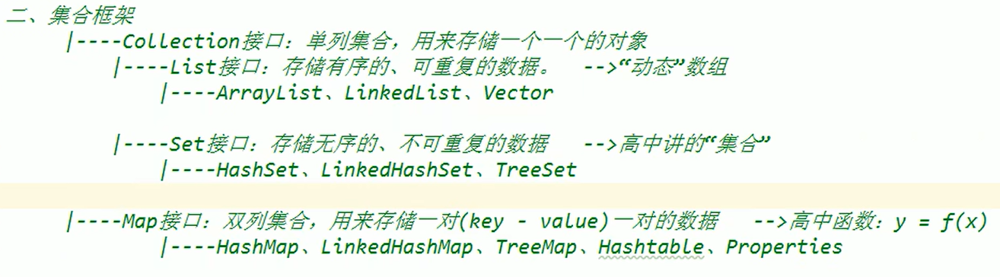
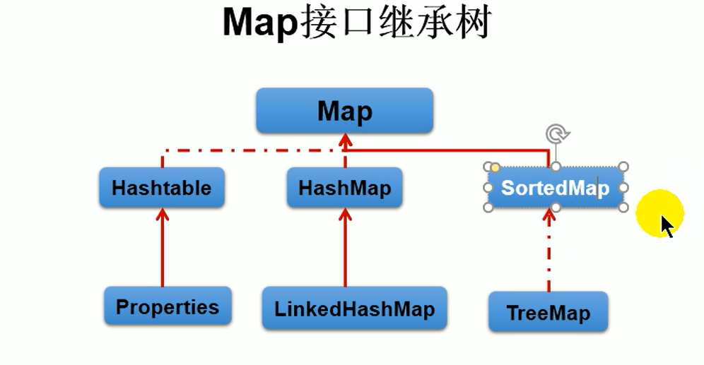

# 集合

## 枚举类（enum）：
使用关键字`enum`声明的类，类中包含的一个属性的所有元素。
### 代码范例：
~~~Java
public class Demo {
    public static void main(String[] args) {
        Color c1 = Color.Red;
        System.out.println(c1);
    }
}
enum Color{
    Red,Green,Blue;
}
~~~
枚举类也可以作为内部类。所有元素使用`,`分隔，使用`;`结束。

### 数组的缺点：
- 一旦初始化，其长度就不可再更改
- 数组中提供的方非常有限，对于添加、删除、插入数据等操作，非常不方便，同时效率不高
- 获取数组中实际元素的个数的需求，数组没有现成的属性或方法可用
- 数组中数据存储的特点：有序、可重复，对于一些无序、不可重复的数据难以处理

**框架 = 注解 + 反射机制 + 设计模式**

## Collection接口：
此集合可以包含**多个重复元素**  
详见集合框架图  
重要的方法：

- boolean add​(E e)  
将指定元素添加到集合中
- boolean addAll​(Collection<? extends E> c)  
将指定集合中的所有元素添加到此集合中
- int size()  
返回此集合中的元素数
- boolean isEmpty()  
如果此集合不包含任何元素，则返回true。
- boolean contains​(Object o)  
如果此collection包含指定的元素，则返回true。该方法调用了指定元素所在类中的equals()，要判断内容的话，最好重写此方法。  
- boolean remove​(Object o)  
从此集合中移除指定元素的单个实例（如果存在），若存在多个重复元素，只删除一个
- boolean removeAll​(Collection<?> c)  
删除此集合中与指定集合重复的元素，若该集合存在多个重复元素，则全部删除。  
- boolean retainAll​(Collection<?> c)  
删除此集合中与指定集合不重复的元素（即生成交集）
- boolean equals​(Object o)  
将指定对象与此集合进行比较以获得相等性。如果集合有序，那么也会判断有序性。
- Object[] toArray()  
返回包含此集合中所有元素的数组。  
*数组转化成集合*：使用Arrays.aslist()，该方法返回一个list<>。但是要注意不能使用`int[]{123,456}`,方法会将该类型数组当成一个元素，而应使用`Interger[]{123,456}`.
- Iterator<E> iterator()  
返回此集合中元素的迭代器。迭代器也就指Iterator，这是一个接口，用来遍历（迭代）集合中的元素，其接口中的next()与hasNext()搭配使用。
***返回的迭代器的堆内存地址与当前调用方相同***

### Iterator接口：
#### boolean hasNext()：
判断当前指针后一位是否存在元素，有为true，无为false，指针不移动
#### E next()：
返回迭代中的下一个元素。操作分为两步，指针后移一位，然后读取当前指针元素，**指针发生了移动**
#### default void remove()：
删除当前指针所指向的元素，请注意，*指针初始位置在“0”位之前*，此时不能使用remove()。删除当前指针的元素后，指针没有更新，指向为空，也不能使用remove()。

### for-each循环：
~~~Java
public void forTest() {
    Collection coll = new ArrayList();

    coll.add("AA");
    coll.add("BB");
    coll.add(false);
    coll.add(new Date());

    for(Object obj : coll) {
        System.out.println(obj);
    }
}
~~~

### Set接口：
无序的、不可重复的。相当于Pyhthon中的字典类型。但是不等于随机性。（存储元素时按照哈希的方式决定存储位置，存储后即固定）。该接口没有再额外的定义新方法。
#### HashSet类:
作为Set接口的主要实现类；线程不安全；可以存储null值。  
    我们向HashSet添加元素a，首先会调用元素a所在类的hashcode()方法，计算元素a的哈希值此哈希值接着会通某种算法计算出元素a在HashSet底层数组中的存放位置（即为：索引位置），然后判断数组此位置上是否已有元素。
1. 如果此位置上没有元素，则添加成功
2. 如果此位置上已有其他元素b（或者以链表的形式存在多个元素），则比较元素a和元素b（或链表上的所有元素）的哈希值，如果哈希值不同，则添加成功。
3. 如果在此位置上元素a与元素b的哈希值一样，进而需要调用元素a所在类的equals()方法。如果equals()返回true，则添加失败；如果返回false则添加成功。

对于已经添加成功的第二种情况和第三种情况，元素a与已经存在于索引位置的数据以链表的方式存储。  
**jdk 7**：  
元素a放入数组中，指向原来的元素
**jdk 8**：  
原来的数组依然在数组中，指向元素a  
**七上八下**

***底层实现***
在HashSet的构造器中，其会构造一个HashMap类。其所有元素都是作为key储存在HashMap中。它们的value是一个静态常量（都指向同一个），是一个空的Object对象。在HashSet中的所有操作都是在操作HashMap。

#### hashcode()：
一个类中应该重写equals()和hashcode()两个方法。IDEA中默认的hashcode()应该是name.hashcode*31+age  
之所以使用31是因为31足够大，能够放大差值；同时又是质数，能够减少冲突（通常会对哈希值进行取模运算以决定索引值）；同时31 = 1<<5 - 1，可以进行位运算，速度快。  
一个类中的hashcode()和equals()应具有一致性：相等的对象必须具有相等的散列码  
***经典代码案例：***
~~~Java
public void test1() {
    person p1 = new person(1011,"AA");
    person p2 = new person(1012,"BB");
    Collection coll = new HashSet();
    coll.add(p1);
    coll.add(p2);
    System.out.println(coll);

    p1.name = "CC";
    coll.remove(p1);//调用p1中的hashcode()以快速查找位置，此时计算的是1011，"CC"的
    //哈希值，查找未果，没有删除
    System.out.println(coll);
    //p1的哈希值与1011，"CC"相同，但是p1储存的是原先的1011，"AA"的位置，所以下面才能
    //添加成功
    coll.add(new person(1011,"CC"));
    System.out.println(coll);
    //尽管新对象计算的哈希值位置已经存在1011,"CC"，但是是否添加成功还要用equals()判断一次
    //内容不同，所以作为新元素与旧元素链接，由旧元素1011，"CC"指向
    coll.add(new person(1011,"AA"));
    System.out.println(coll);
}
~~~

#### LinkedHashSet类：
该类是HashSet类的子类，底层存在双向链表；遍历其内部元素时，可以按照添加的顺序遍历。  
其实现原理的理解比较容易，其存储的是一个Node（包含前地址，元素和后地址），每往LinkedHashSet中放置元素，都是按照hash的方式随机放置，但是防止后的Node存储了上一个Node和下一个Node的地址，这就在无序上构建了有序。在进行频繁的遍历操作时LinkedHashSet的效率要高于HashSet。

#### TreeSet类：
底层是红黑树，只允许存储同一种属性的元素；可以按照添加对象的指定属性，进行排序。  
其有两种排序方式：自然排序和定制排序。  
- 自然排序  
调用的是元素所在类的compareTo()而非equals()。TreeSet类在调用add()方法时就已经在排序，TreeSet类排序的默认规则是按照红黑树的逻辑，该类会调用添加元素所在类的compareTo()方法，所以如果这是我们自建的类，我们应该要先**实现Comparable接口**，然后再重写compareTo()
~~~Java
@Override
public int compareTo(Object o) {
    if (o instanceof Person) {
        Person p = (Person) o;
        return this.name.compareTo(p.name) + Integer.compare(this.age, p.age);
    }else {
        throw new RuntimeException("输入的类型不匹配");
    }
}
~~~
- 定制排序  
在TreeSet类的构造器中提供了一种方式，允许传入Comparator对象，使用Comparator对象中重写的compareTo()进行排序。使用顺序为：创建Comparator实例，重写compareTo()，传入TreeSet构造器。
~~~Java
Comparator com = (o1, o2) -> {
    if (o1 instanceof Person && o2 instanceof Person){
        Person p1 = (Person) o1;
        Person p2 = (Person) o2;
        int result = p1.getName().compareTo(p2.getName());
        if (result == 0){
            return Integer.compare(p1.getAge(),p2.getAge());
        }else
            return result;
    }else
        throw new RuntimeException("输入的类型不匹配");
};
~~~

### List接口：
有序的、可重复的，常用于替代数组，称为“动态”数组

#### 常用方法：  
- static <E> List<E> copyOf​(Collection<? extends E> coll)  
    以迭代顺序返回包含给定Collection的元素的unmodifiable List 。 给定的Collection不能为null，并且不能包含任何null元素。 如果随后修改了给定的Collection，则返回的List将不会反映此类修改。
- E get​(int index)  
    返回此列表中指定位置的元素。
- E set​(int index, E element)  
    用指定的元素替换此列表中指定位置的元素（可选操作）。
- E remove​(int index)  
    删除此列表中指定位置的元素（可选操作）。将任何后续元素向左移位（从索引中减去一个元素）。返回从列表中删除的元素。该方法与Collection接口中的remove()是重载关系。如果调用方法remove(2)，编译器会识别为索引（Collection中的方法要自动装箱，更麻烦），如果真想删除数字“2”，使用remove((Integer) 2)。
- int indexOf​(Object o)  
    返回此列表中第一次出现的指定元素的索引，如果此列表不包含该元素，则返回-1。
- List<E> subList​(int fromIndex, int toIndex)  
    返回指定的fromIndex （包含）和toIndex （不包括）之间的此列表部分的视图。即左闭右开，如果想返回最后一个元素，索引可以“越界”

#### ArrayList类：
作为List接口的主要实现类；线程不安全、效率高；底层使用Object[] elementData存储（单向链表）。
##### 源码分析：
**jdk 7**:  
ArrayList list = new ArrayList();//底层创建了长度为10的Object[]数组elementData。  
list.add(123);//elementData[0] = new Integer(123);  
···  
list.add(11);//如果此次添加时数组内存不足，则扩容。默认情况下，数组容量扩增至原来的1.5倍，同时将旧数组中的元素复制到新数组中。  
在开发的过程中建议使用带参构造：ArrayList list = new ArrayList(int capacity)  

**jdk 8**：
在jdk 8中，ArrayList发生了变化。  
ArrayList list = new ArrayList();//底层Object[] elementData初始化为{}，没有创建长度为10的数组。  
list.add(11);//第一次调用add()时，底层才创建了长度为10的数组，并将数据添加到新数组中。  
如果一次性添加的元素个数超过了原数组大小的1.5倍，则按照新增元素个数去创建  
其余添加与扩容方法与jdk 7无异。

**区别**：
jdk 7中的ArrayList类似于单例的饿汉式，而jdk 8中的ArrayList类似于单例中的懒汉式，延迟了数组的创建，节省了内存。

#### LinkedList类：
对于频繁的插入、删除操作，使用此类的效率要比ArrayList高；底层使用的是双向链表。
##### 源码分析：
LinkedList类中定义了一个内部类Node，该类相当于一个链表（prev储存前一个Node，element为当前元素，next储存下一个Node）
~~~Java
void linkLast(E e) {
    final Node<E> l = last;
    final Node<E> newNode = new Node<>(l, e, null);
    last = newNode;
    if (l == null)
        first = newNode;
    else
        l.next = newNode;
    size++;
    modCount++;
}
~~~

#### Vector类：
作为List接口的古老实现类；线程安全，但是效率低；底层使用Object[] elementData存储  
其扩容的方式有点不同于ArrayList，其扩容是增加到原来的2倍（而非1.5倍），并且Vector类的方式更加安全（使用synchronized同步）。  
但是后续开发涉及到多线程的集合时，也一般不用Vector，在工具类Collections中提供了相应的方法去同步ArrayList。  
Stack类（栈）是Vector类的子类，其对数据的存储与操作更加严格，添加的时候只能作为最后一个元素而存储，删除的时候只能从最后一个元素开始删除。

## Map（映射）接口：

Map中的**key**是无序的、不可重复的，在Collection中只有Set类型符合（具体是什么类，还要看是什么Map类型，HashMap对应的就是HashSet）。自然而然地，我们在将自定义类作为key传入的时候，要相应的重写equals()和hashCode()或者compareTo()。  
**我们不建议去修改key**，因为这样的操作代价太大。根据HashSet中某一处的代码分析已经指出：在key值修改后，其哈希值也已经发生了改变，但是存储位置没有更新。当下次查询该值时，由于key值已更改，会按照更改后的哈希值查询。其次，·······  
Map中的**value**是无序的，可重复的，没有太多要求，在实现的时候，使用Collection类型。在将自定义类作为参数传入value时，只需要重写equals()方法。  
**entry**时Map中的存储单位，一个entry存储一个Set类的key和一个Collection类的value。所有的entry使用Set存储。

### Map的主要操作方法：
添加、删除修改操作：
- Object put(Object key,Object value)
    将指定key-value添加到或修改当前map对象中
- void putAll(Map m):
    将m中的所有key-value 对存放到当前map中
- Object remove(Object key)：
    移除指定 key的key-value对，并返回value
- void clear()：
    清空当前map中的所有数据（这里只是清除了Map中的所有元素，内容为空，但是其地址仍然存在，并不等效于map = null;，执行map.size()并不会报错）
---
元素查询的操作：
- Object get(Object key)：
    获取指定key对应的value
- boolean containsKey(Object key)：
    是否包含指定的key
- boolean containsValue(Object value)：
    是否包含指定的value
- int size()：
    返回map中key-value对的个数
- boolean isEmpty()：
    判断当前map是否为空
- boolean equals(Object obj)：
    判断当前map和参数对象obj是否相等
---
元视图操作的方法：

### HashMap类：
作为Map的主要实现类；线程不安全，但是效率高；可以存储null的key和value（jdk 8以前，没有使用红黑树，只是单纯的数组+链表）  

---
***尽量多去查看和理解源码***

---

#### JDK 7：
HashMap map = new HashMap();执行完该语句后底层创建了长度为16的一维数组Entry[] table。
map.put(key1,value1);
1. 首先调用key1所在类的hashCode()计算哈希值，此哈希值经过某种计算（默认使用与运算：“&”，和数组的长度）后得到在Entry数组中的存放位置。
2. 如果该位置上的数据为空，此key1-value1添加成功
3. 如果此位置上的数据不为空，（意味着这个位置上至少有一个元素或多个以链表形式存在的元素），比较key1与该位置的其他元素的哈希值。
4. 如果key1的哈希值与已存在的其他key的哈希值均不相同，则该key1-value1添加成功。（以链表形式存储）
5. 如果key1的哈希值与已存在的另一个键key2的哈希值相同：继续比较
6. 调用key1所在的equals()判断，key1.equals(key2);
7. 如果equals返回false，则key1-value1添加成功（以链表的形式存储）
8. 如果返回true，则使用**vulue1替代原有的value2**

当存储量超过了*临界值*（且要存放的位置非空）时会进行扩容。在不断的扩容过程中，扩容一次增加为**原来的2倍**。扩容后，原有的链表可能会发生改变（要对所有元素重新计算）不再存在。  
链表的存储遵循七上八下的规律。

#### JDK 8：
JDK 8做出的更改：
1. new HashMap()时，底层并没有创建长度为16的数组
2. JDK 8的底层数组是Node[]而非Entry[]
3. 首次调用put()方法时，底层才会创建长度为16的数组
4. JDK 8在JDK 7原有的“数组+链表”的底层结构基础上增添为“数组+链表+红黑树”。当某一索位置上存储的元素以链表的形式存在的数据个数超过8个（>=9)且当前数组的长度> 64时，此索引位置上的所有数据更改为使用红黑树存储（查询更加高效、迅速），当数组本身不够长时，还硬要使用树形结构则容易占用大，效率耕低下

源码中的常量：
1. DEFAULT_INITIAL_CAPACITY：
    HashMap中的默认容量：16
2. DEFAULT_LOAD_FACTOR：
    HashMap中的默认加载因子：0.75
3. threshold：
    扩容的临界值，=容量*填充因子
    16*0.75=12
4. TREEIFY_THRESHOLD:
    Bucket 中链表长度大于该默认值，转化为红黑树
5. MIN_TREEIFY_CAPACITY:
    桶中的Node被树化时最小的hash表容量:64

#### LinkedHashMap类：
在作遍历、循环的时候效率不高，同LinkedHashSet与LinkedList一样，使用双向链表  
在LinkedHashMap中，其并没有去重写put方法，而是重写了newNode()。put()会调用putVal()，putVal()会调用newNode()。在LinkedHashMap()中的存储单位是Entry（其继承的是HashMap中的Node，具有双向链表的属性），最后执行一系列的添加数组、指针的操作。

### TreeMap类：
保证添加的键值对进行排序，实现排序遍历（通常是根据key值排序）  
底层是红黑树的原理

### Hashtable类：
作为古老的实现类；线程安全，但是效率低；不能存储null的key和value

#### Properties类：
//554